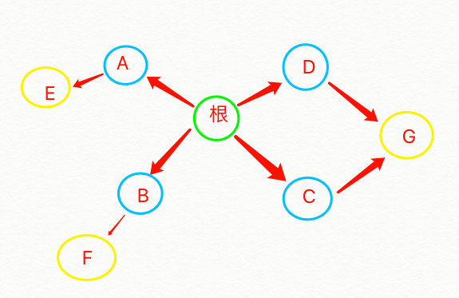

---
title: 广度优先搜索
---  
# 广度优先搜索    

### 什么是广度优先搜索？  

广度优先搜索是一种用于图的查找算法。优先遍历最接近根节点的节点。  

   

如上图所示，广度优先搜索是先从根节点找与根节点相连，并且最接近的一圈节点开始遍历，也就是先遍历第一层蓝色的圆圈部分，再遍历第二层黄圈的部分。  
其中右边的第二层黄圈节点与两个节点都有相连关系，避免重复遍历，则需要再遍历节点后，将其标记为`已遍历`。  

### 广度优先搜索主要用来解决什么问题？ 

* 第一类问题：从节点`A`出发，有前往节点`B`的路径吗？  
    比如：你要在你的朋友中找到一位认识`周杰伦`的朋友，你就必须把你的朋友（第一层）都列出来，依次检查每个人是否有认识`周杰伦`的人，有则结束，没有则在朋友的朋友（第二层）中来搜索，以此类推第三层，第四层...  

* 第二类问题：从节点`A`出发，前往节点`B`的哪条路径最短？  
    也就是你要找这个认识`周杰伦`的人，最少得通过几个人（几层关系）找到。  

### 如何进行广度优先搜索？  

广度优先搜索必须是按顺序进行的，避免重复搜索，或者出现无限循环的情况。  
由于是按顺序进行的，则先加入到搜索队列的，优先搜索，符合先进先出，所以可以用队列来实现。

> 队列：是一种先进先出（First In First Out, FIFO）的数据结构。支持两种操作：入队和出队。   

再以此图为例：

    

1. 创建队列数据结构，并创建一个空间，用来存储已遍历节点  
2. 将第一层待搜索节点`[A, B, C, D]`加入队列    
3. 先搜索最先加入队列的`A`，此时待搜索队列为`[B, C, D]`
4. 发现`A`并不是我要搜索的目标时，就将与`A`节点的相连最近的下一层节点`E`加入队列，此时待搜索队列为`[B, C, D, E]`，并将`A`标记为已遍历的节点，推入已遍历的数组 
5. 再对`B`进行搜索，如果依然不是目标，就将与`B`节点的相连最近的下一层节点`F`加入队列，此时待搜索队列为`[C, D, E, F]`，并将`B`标记为已遍历的节点，推入已遍历的数组  
6. 如此反复，直至搜寻到目标  
7. 每次搜索节点前，请记住先看它是否在已遍历的数组中，如果是的，则搜索下一个  
