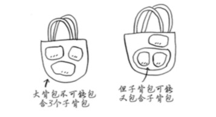

---
title: 动态规划
--- 

# 动态规划    

### 设计理念  
动态规划算法设计，最多只需要合并两个子问题，根本不会涉及到两个以上的子问题。但是子问题里面可以包含子问题。  

  

### 适用问题特点 
* 问题具有最优子结构性质。如果问题的最优解所包含的子问题的解也是最优的，我们就成该问题具有最优子结构性质  
* 无后效性或者说无关联。当前的若干个状态值一旦确定，则此后过程的演变就只和这若干个状态的值有关，和之前是采取哪种手段或者经过那条路径演变到当前的这若干个状态，没有关系  

> 仅当每个子问题都是离散的，即不依赖于其他子问题时，动态规划才管用