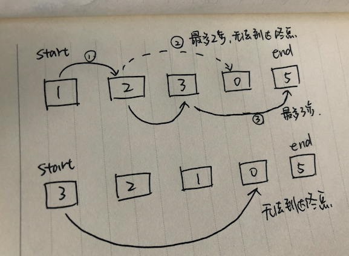
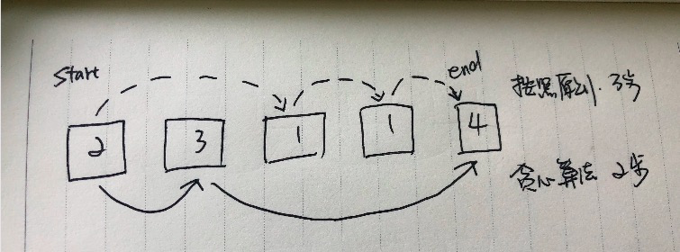

---
title: 贪心算法
--- 

# 贪心算法   

贪心算法就是每一步都采用最优的做法。（每一步都选择局部最优解，最终得到全局最优解）  

### 思路  

> 大事化小，小事化了  

* 大事化小：将大问题，找到与子问题的重叠，把复杂的问题规划成多个小问题    
* 小事化了：从小问题找到决策的核心，确定一种得到最优解的策略  

例子：比如用最少的钱币数量，凑成一百块。   

在生活中，我们经常能应用到这个算法，凑成一百块，肯定先从一百块下面`面值最大`的开始凑，五十，再二十，再十块，五块......    
面值最大，则是这个问题决策的核心。  

### 具体例子 

跳一跳  
给定一个数组，从数组第一个值开始往后跳，当前的元素值代表可以跳的最大步数，请问最少多少步能到达最后一个元素的位置？    

数组为`[1, 2, 3, 0, 5]`  

分析：既然要用最少的步数到达最后一个元素的位置，则说明我每一步要尽可能跳的远才行  
* 从第一个元素`1`开始，最多只能跳一步  
* 来到了第二个元素`2`，最多可以跳两步，跳到第一步发现元素值为`3`，则说明我在这里可以还最多跳三步，比前面跳两步跳的更远  
* 到达最后的元素位置  
* 答案为`2`

数组为`[3, 2, 1, 0, 5]` ，则永远到不了最后一个位置。  

   

数组为`[2, 3, 1, 1, 4]`

 
