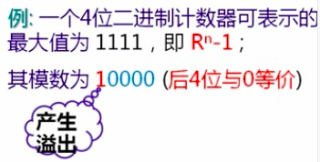

---
title: 基础内容
---  

# 二进制  

### 计算机的进制有哪些？  
* 二进制 （计算机的数制）
* 十进制 （人类的数制）
* 八进制 （用于中和沟通人与计算机之间的数制）
* 十六进制 （用于中和沟通人与计算机之间的数制）

### 重要概念 位值（权值）  
由位值决定数值大小的值

### 如何来计算进制？
* 把其它进制转成十进制
> 任何一个数值，都是各位数字本身的值与其权之积的总和。 

  
    

* 把十进制转成其它进制

> 十进制整数精确转换成二进制整数：不断除以基数（2， 8， 16），倒序取余数 

例如：十进制整数精确转换成二进制整数：


> 十进制小数转换成二进制小数：不断乘以基数2，正序取整数部分进位，一直到小数点后为0才是最精确的
例如：十进制小数转换成二进制小数：
  

整数转换可以精确转换，小数做不到完全精确转换  

### 机器数、真值与模  
* 机器数： （含符号）数在机器中的编码表示  
* 真值：机器数所对应的真实数值，一般用十进制数形式  
* 模数：计数器从”0“开始计数，所能计的数值的个数（基数的n次方）即模数  
```js
    模数 = 最大值 + 1
```  
    

其实溢出的则是这个模数  

### 逻辑运算  
* 真：1，假：0  
* 逻辑值：  
    1. ”与“：只有两个值都为真时，才能为真。相当于乘法。  
    ```js
    /* 有一个为假，则为假 */
    1 * 0 = 0 
    /* 两个值都为真，则为真 */
    1 * 1 = 1 
    ```
    2. ”或“：只要有一个值为真，则为真。相当于加法。  
    ```js
    /* 有一个为真，则为真 */
    1 + 0 = 1 
    /* 两个值都为假，才为假 */
    0 + 0 = 0 
    ```
    3. ”非“：取反，值为真，则结果为假；值为假，则结果为真。  
    4. ”异或“：两值相异为真，两值相同为假。  
    ```js
    1, 1 = 1  
    1, 0  = 0  
    0, 0 = 1  
    0, 1 = 0
    ```   


