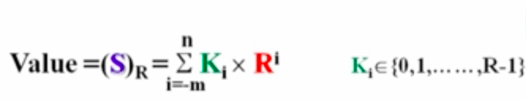
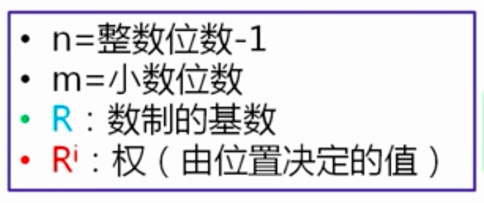
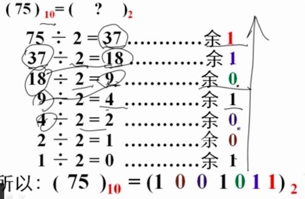
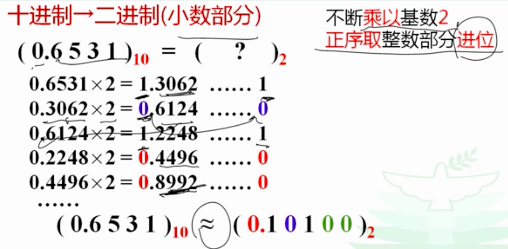

---
title: 基础内容
---  

# 二进制  

### 计算机的进制有哪些？  
* 二进制 （计算机的数制）
* 十进制 （人类的数制）
* 八进制 （用于中和沟通人与计算机之间的数制）
* 十六进制 （用于中和沟通人与计算机之间的数制）

### 重要概念 位值（权值）  
由位值决定数值大小的值

### 如何来计算进制？
* 把其它进制转成十进制
> 任何一个数值，都是各位数字本身的值与其权之积的总和。 

  
    

* 把十进制转成其它进制

> 十进制整数精确转换成二进制整数：不断除以基数（2， 8， 16），倒序取余数 

例如：十进制整数精确转换成二进制整数：

> 十进制小数转换成二进制小数：不断乘以基数2，正序取整数部分进位，一直到小数点后为0才是最精确的
例如：十进制小数转换成二进制小数：
  

整数转换可以精确转换，小数做不到完全精确转换

