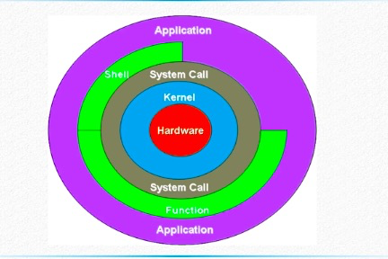

---
title: Linux操作系统编程
---  
# <font color="#6A5ACD">Linux操作系统编程</font>    

### 基础知识
#### 内存管理 
* 内存分配调用：
    * 静态分配：需要预先分配存储空间
    * 动态分配：是指在程序执行的过程中动态地分配或者回收存储空间的分配内存的方法，由系统根据程序的需要即时分配，且分配的大小就是程序要求的大小
* 内存保护：确保每个程序在自己的内存空间运行、互不干扰。方法是使用界限寄存器或存储保护键
* 地址映射：实现程序的了逻辑地址与存储器的物理地址之间的映射功能
* 内存扩充：从逻辑上扩充物理内存，以允许比物理内存更大的程序在机器内运行，为此操作系统必须具有：请求调入功能与置换功能  
#### 进程管理  
* 进程控制：包括进程创建、进程撤销、进程阻塞、进程唤醒
* 进程协调：由于进程运行的异步性，因此进程同步的任务是对诸进程的运行协调，包括两种方式：
    * 进程互斥方式：是指多个进程对临界资源进行访问时，应该采用这种方式  
    * 进程同步方式：在相互合作去完成多个任务之间，进程同步机构对他们的次序加以协调
* 进程通信：主要完成同一台机器上不同进程间通信和不同机器上进程间的通信，以共同完成一相同的任务
* 进程调度：操作系统按照一定的规则对等待运行的多道程序进行调度，以保证每个程序都能有机会得到运行，并最终完成
#### 文件管理
* 文件存储空间的管理：为每一文件分配必要的外存空间。为提高外部存储空间的利用率，系统应设置相应的数据结构，用于记录文件存储空间的使用情况
* 目录管理：为了方便对用户的文件进行管理，对文件系统建立一定结构的目录结构，同时要求快速的目录查询手段
* 文件的读、写管理和存取控制：利用一定的系统调用对文件进行读写操作。同时，为防止系统中的文件被非法访问和窃取，文件系统中必须提供有效存取控制功能  
#### 设备管理  
* 缓冲管理：管理各种类型的缓冲区，如字符缓冲区和块缓冲区，以缓和CPU和I/O速度不匹配的矛盾，最终达到提高CPU和I/O设备的利用率，进而提高系统吞吐量的目的
* 设备分配：利用用户的I/O请求，为之分配其所需要的设备
* 设备处理：又称为设备驱动程序，任务是实现CPU和设备控制器之间的通信
* 设备独立性和虚拟设备：一方面保证用户程序独立于物理设备，另一方面保证多个进程能并发地共享一个设备  
#### 操作系统用户接口
* 命令接口：以命令形式呈现在用户面前，方便用户直接或间接控制自己的作业
* 程序接口：为应用程序使用系统功能而设置，是应用程序取得操作系统服务的唯一途径。由一系列系统调用组成，每一个系统调用都是一个能完成特定功能的子程序
* 图形接口：采用了图形化的操作界面，将各种应用程序和文件，直观、逼真的表示出来
#### 系统调用
* 系统调用是内核提供的程序接口，是应用程序和硬件设备之间的中间层   
* 查询内核中所有的系统调用的命令：
    ```linux
    man 2 syscalls
    ```
* 系统调用分类：
    * 文件操作类系统调用：如打开、创建、读取、删除、修改文件
    * 进程控制类系统调用：如创建进程、设置或获取进程属性等
    * 通信类系统调用：创建进程间的通信连接，发送、接收消息，或其他的通信方式
    * 设备管理类系统调用：打开、关闭和操作设备
    * 信息维护类系统调用：在用户程序和OS之间传递信息，例如，系统用户程序传送当前时间、日期、操作系统版本号等  
#### UNIX/Linux软件层次架构
* 图：  
      
> 简单总结： Linux利用内核实现了软硬件的对话，通过系统调用这个接口，将上层的应用与下层的内核分离，隐藏了底层的复杂性，也提高了上层应用的可移植性。库函数利用系统调用创造出模块化的功能，而shell则提供了一个用户界面，让我们可以利用shell的语法编写脚本，从而整合程序。  
#### 常用UNIX/Linux命令  
* 命令格式：命令名称 -选项 /参数  
    ```linux
    ls -la /etc
    ```
    * 浏览目录命令：ls，pwd
    * 目录操作命令：cd，mkdir，rmdir
    * 浏览文件命令：cat，more，less，head，tail
    * 文件操作命令：cp，rm，mv，find，grep，tar
### 文件和目录  
### 进程和线程
### 线程同步与进程间通信