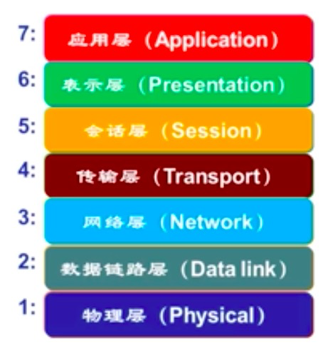
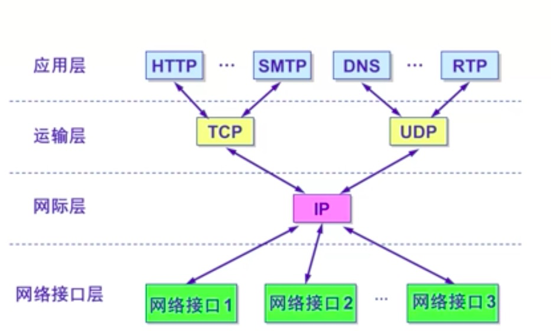
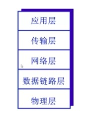
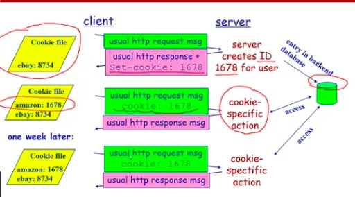
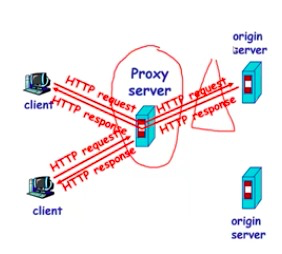
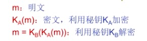

---
title: 计算机网络  
---  
# 计算机网络  

带宽：最高数据传播速率  
丢包：在通信中是指通信数据包丢失，就是数据丢失  
比特(bit)：信息的最小单位  
吞吐量：表示在发送端与接收端之间传送数据速率  

### 计算机网络体系结构   

> 网络体系结构是从功能上描述计算机网络结构

* 分层结构  
    1. 每层遵循某个/些网络协议完成本层结构  
    2. 结构清晰，有利于识别复杂系统的部件及其关系 
    3. 模块化的分层易于系统更新，维护  
    4. 有利于标准化  

* OSI参考模型  
> 开放系统互联（OSI）参考模型是由国际标准化组织（ISO）于1984年提出的分层网络体系结构模型  
由下至上，一共七层：  
  

* TCP/IP参考模型  
  

* 5层参考模型 (我们主要现在用于应用分析的模型)
   
    1. 应用层：支持各种网络应用（FTP(文件传输协议)、SMTP(电子邮件协议)、HTTP(web协议)）-- 数据单元：报文
    2. 传输层：进程-进程的数据传输（TCP(传输控制协议)、UDP(用户数据报协议)）-- 数据单元：段
    3. 网络层：源主机到目的主机的数据分组路由与转发（IP协议、路由协议等）-- 数据单元：数据报
    4. 链路层：相邻网络元素（主机、交换机、路由器等）的数据传输（以太网、802.11(WiFi)、PPP） -- 帧
    5. 物理层：比特传输 --数据单元：比特  

### 网络应用的体系结构  
* 客户机/服务器结构 （C/S）   
> 比如web应用 
1. 服务器：  
    * 7*24小时提供服务  
    * 永久性访问地址/域名  
    * 利用大量服务器实现可扩展性  
2. 客户机：  
    * 与服务器通信，使用服务器提供的服务  
    * 间歇性接入网络  
    * 可能使用动态IP地址  
    * 不会与其他客户机直接通信

* 纯P2P结构 
> 文件共享等等 
1. 没有永远在线的服务器  
2. 任意端系统/节点之间可以直接通讯  
3. 节点间歇性接入网络  
4. 节点可能改变IP地址  

* 混合结构  
Napster  

#### Socket (套接字)  
* 进程间通信利用Socket发送/接收消息实现  
* 传输基础设施向进程提供API  
    1. 传输协议的选择  
    2. 参数的设置  

#### 如何寻址进程？
* 不同主机上的进程间通信，那么每个进程必须拥有标识符
* 如何寻址主机？ ———— IP地址  
* 如何寻址进程？ 别人发QQ消息给我，那通过寻址，怎么找到我对应的QQ进程，而不是发到网易云音乐进程呢？ ———— 端口号/Port number    
    1. 为主机每个需要通信的进程分配一个端口号  
    2. HTTP Server: 80  
    3. Mail Server: 25  
* 进程的标识符  
IP地址 + 端口号  

#### 应用层协议的内容  
* 消息的类型（type） 
    1. 请求消息
    2. 响应消息  
* 消息的语法（syntax）/ 格式  
    1. 消息中有哪些字段（field）?
    2. 每个字段如何描述  
* 字段的语义  
    1. 字段中信息的含义  
* 规则  
    1. 进程何时发送/响应消息  
    2. 进程如何发送/响应消息  

### Web应用  
* 网页包括多个对象  
    1. 对象：HTML文件、JPEG图片、视频文件、动态脚本等  
    2. 基本HTML文件：包含对其他对象引用的链接  
* 对象的寻址    
    URL：统一资源定位器 
    格式：Scheme://host:port/path  (协议://主机IP地址:端口号/路径)  

> Web 应用使用的是 HTTP 协议  

### HTTP协议 
> 使用TCP传输服务，是无状态的协议，不会记录访问者的历史行为
* 服务器在80端口等待客户的请求  
* 浏览器发起到服务器的TCP连接（创建套接字Socket）
* 服务器接收来自浏览器的TCP连接  
* 浏览器（HTTP客户端）与Web服务器（HTTP服务器）交换HTTP消息  
* 关闭TCP连接     

### Cookie技术  
* 为什么需要Cookie?  
答：因为HTTP协议是无状态的，无法记录访问者的历史行为。但是有时候是需要记录状态的。   
* 某些网站为了辨别用户身份，进行session跟踪而储存在用户本地终端上的数据（通常经过加密）  
* Cookie的组件（由哪些部分构成）  
    1. HTTP响应消息的cookie头部行 
    2. HTTP请求消息的cookie头部行 
    3. 保存在客户端主机上的cookie文件，由浏览器管理
    4.  Web服务器端的后台数据库 

* Cookie的原理  
    
* Cookie有隐私的问题  

### Web缓存/代理服务器技术  
> 在不访问服务器的前提下满足客户端的HTTP请求  
* 为什么要发明这种技术？  
    1. 缩短客户请求的响应时间  
    2. 减少机构/组织的流量  
    3. 在大范围内实现有效的内容分发(CDN内容分发网络)  

* Web缓存/代理服务器  
    1. 用户设定浏览器通过缓存进行Web访问  
    2. 浏览器向缓存/代理服务器发送所有的HTTP请求  
        * 如果所请求对象在缓存中，缓存返回对象  
        * 否则，缓存服务器向原始服务器发送HTTP请求，获取对象，然后返回给客户端并保存该对象  
    3. 缓存既充当客户端，也充当服务器  
    4. 一般由ISP（Internet服务提供商）架设    

   

* 目标：如果缓存有最新的版本，则不需要发送请求对象  
* 缓存：在HTTP请求消息中生命所持有版本的日期（If-modified-since:data）  
* 服务器：如果缓存的版本是最新的，则响应消息中不包含对象，HTTP/1.0 304 Not Modified

### DNS (域名解析系统)  
* Internet上主机/路由器的识别问题  
    * IP地址 
    * 域名：www.baidu.com  
* 问题：域名和IP地址之间如何映射？  
答：所以出现了域名解析系统DNS  

* 多层命名服务器构成的分布式数据库  
* DNS本身也是一个应用层协议：完成名字的解析  
    * Internet核心功能，用应用层协议在应用层实现  
    * 网络边界复杂    

### Socket编程   

#### Socket API
* 标识通信端点（对外）：  
    * IP地址 + 端口号  
* 操作系统/进程如何管理套接字（对内）？  
答：套接字描述符（socket descriptor）, 小整数   

#### Socket API函数  
以WinSocket（windows系统）为例：
* WSAStartup：使用Socket的应用程序在使用Socket之前必须首先调用这个函数  
* WSACleanup：应用程序在完成对请求的Socket库的使用，最后要调用这个函数，解除与Socket库的绑定，释放Socket库所占用的系统资源  
* Closesocket：关闭一个描述符为sd的套接字；如果过个进程共享一个套接字，调用这个方法是将套接字引用计数减1，减至0才关闭；一个进程中的多线程对一个套接字的使用无计数（如果进程中的一个线程将一个套接字关闭，该进程中的其他线程也将不能访问该套接字）；返回值：0为成功；SOCKET_ERROR：失败。  

#### TCP 客户端软件流程  
1. 确定服务器IP地址与端口号  
2. 创建本地套接字  
3. 分配本地端点地址（IP地址+端口号）
4. 连接服务器（套接字）  
5. 遵循应用层协议进行通信  
6. 关闭/释放连接  

#### UDP 客户端软件流程  
1. 确定服务器IP地址与端口号  
2. 创建本地套接字  
3. 分配本地端点地址（IP地址+端口号）
4. 指定服务器端点地址，构造UDP数据报  
5. 遵循应用层协议进行通信  
6. 关闭/释放套接字    

### 计算机网络安全  

* 网络安全基本属性  
    * 机密性：只有发送方与预定接收方能够理解报文内容（发送方加密报文，接收方解密报文）  
    * 身份认证：发送方与接收方希望确认彼此的真实身份  
    * 信息完成性：发送方与接收方希望确保信息未被篡改（传输途中或者后期），发生篡改一定会被检测到  
    * 可访问与可用性：网络服务必须对被授权用户可访问与可用

* 网络安全的基本特征  
    * 相对性：只有相对的安全，没有绝对的安全  
    * 时效性：新的漏洞与攻击方法不断发现  
    * 相关性：新配置、新系统组件可能会引入新的安全问题  
    * 不确定性：攻击时间、攻击者、攻击目标和攻击发起的地点都具有不确定性  
    * 复杂性：网络安全是一项系统工程，需要技术和非技术的手段   
    * 重要性：网络安全关乎国家、政府、企业、个人的安全

* 密码学基础（加密基础）
  > 对称密钥：  A 明文 => 加密算法 + KA 加密密钥 => 密文 => 解密算法 + KB 解密密钥 => 明文   

     

* 传统加密方法  
    * 替代密码：利用一种东西替代另一种东西（凯撒密码，单码替代，多码替代）
    * 换位密码：重新排列明文中的字母 （置换法，列置换加密）  
* 现代加密方法 （不再针对一个个字母，而是针对二进制位操作）
    * 对称密钥加密  
    * 非对称密钥加密  
    ...    

* 身份认证
    * 添加IP地址
    * 添加加密口令
    * 添加加密的加密口令
    * 添加一次性随机数：一个生命周期内只用一次的数
    * 添加一次性随机数 + 公钥加密技术  

#### Web应用安全威胁  

* Web安全威胁的分类：  
    * 主动攻击：篡改C/S之间信息或篡改Web站点信息（难防易检）  
    * 被动攻击：监听数据流获取信息或进行信息量分析（难检易防）  
* 机密性
    * 网络监听、窃听数据  
* 完整性
    * 修改用户数据、修改传输的信息  
* 拒绝服务
    * 伪造请求淹没服务器  
* 身份认证 
    * 冒充合法用户、伪造数据
* Web服务器的安全威胁
    * 服务越强大，包含安全漏洞概率就越高 
    * HTTP服务可在不同权限下运行  
* Web浏览器的安全威胁
    * 活动Web页可能隐藏恶意程序  
* 通信信道的安全威胁
    * 监听程序会威胁通信信道中所传输信息的机密性
    * 伪造、篡改、重放会威胁所传输信息的完整性  
    * 缺乏身份认证使得冒充他人身份进行中间人攻击  
    * 缺乏数字签名机制使得通信双方能相互攻击  
    * 拒绝服务攻击使得通信信道不能保证可用性  

 

 

