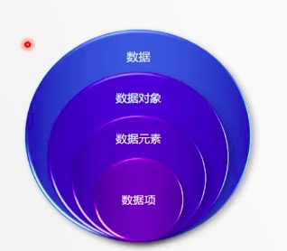
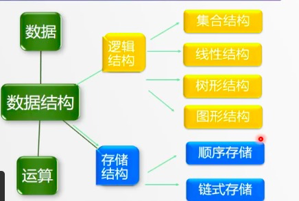

---
title: 基本概念
---  
# <font color="#FA8072">基本概念</font>  

> 程序 = 算法 + 数据结构，算法 = 逻辑 + 控制

### 相关术语  
* 数据（data）：所有能够被计算机识别的符号集合
* 数据元素（Data Element）：是数据（集合）中的一个”个体“；是数据结构中讨论的基本单位
* 数据项（Data）：是数据结构中讨论的最小单位；数据元素可以是数据项的集合
* 数据对象（Data Object）：是具有相同性质的数据元素的集合，是数据的一个子集   

四个之间的关系其实是集合与子集的关系：  
   

* 数据结构：带结构的数据元素的集合   
    * 数据结构由一个四元组来表示：  
    ```js
    Data_Structure = ( D, L, S, O )   
    ```  
    * D => 数据元素  
    * L => 逻辑关系  
    * S => 存储表示  
    * O => 操作  
    > 数据元素、数据元素之间的逻辑关系，逻辑关系在计算机中的存储表示，以及所规定的操作这四部分  
* 逻辑结构：数据元素之间客观存在的关系，和数据在计算机中如何存储无关，主要用于人们理解和交流，以及指导算法的设计  
    * 线性结构：数据元素之间是一对一的关系
    * 树形结构：数据元素之间是一对多的关系（非线性结构）
    * 图形结构：数据元素之间是多对多的关系（非线性结构）
    * 集合结构：数据元素是一个集合，数据元素之间的关系是极为松散的结构
* 存储结构：
    * 顺序存储：把逻辑上相邻的元素存储在物理位置相邻的存储单元中 
    * 链式存储：在数据元素中添加一些地址域或辅助结构，用于存放数据元素之间的关系   

总结如下：  
  
### 数据结构 
* 用途：
    * 用于存放要处理的数组
    * 实现算法策略  

* 常见的数据结构有：数组、栈、队列、表、串、树、图和文件等  