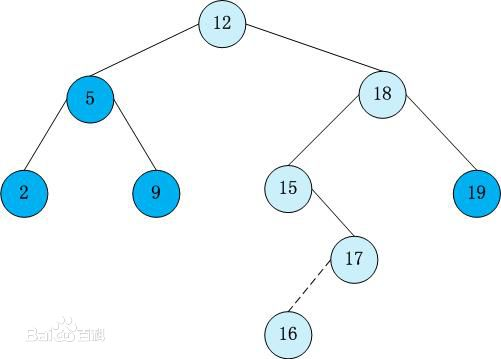
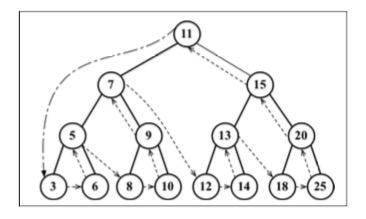
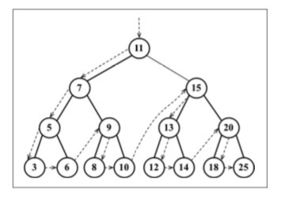
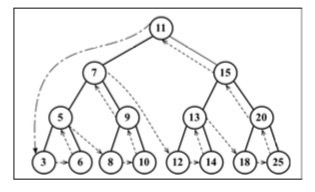

# <font color="#3CB371">树</font>

### 概念

-   根节点：位于树顶部的节点，它没有父节点
-   内部节点：至少有一个子节点
-   外部节点/叶节点：没有子元素的节点
-   子树：由节点和它的后代构成
-   深度：节点的一个属性，主要取决于它的祖先节点的数量，拥有多少个祖先节点，则深度为多少
-   高度：取决于所有节点深度的最大值，也是整个树的层级为多少。根节点为 0 层，它的子节点为第 1 层，以此类推。看最多多少层，则高度为几

### 二叉树，二叉搜索树

-   二叉树：二叉树中的节点最多只能有两个子节点：一个是左侧子节点，另一个是右侧子节点
-   二叉搜索树：它只允许你在左侧节点存储（比父节点）小的值，在右侧节点存储（比父节点）大（或者等于）的值。  



### 创建 BinarySearchTree 类 （二叉搜索树）

```js
// 创建BinarySearchTree类
function BinarySearchTree() {
    var Node = function(key) {
        this.key = key; // key为节点的键
        this.left = null;
        this.right = null;
    };

    var root = null;
    this.insert =  function(key){
        ...
    }
}
```

### 插入操作，向树中插入一个键  

```js
// 向树中插入一个键
this.insert = function(key) {
    var newNode = new Node(key);

    // 如果根节点为空，则将根节点指向新节点，否则执行插入操作
    if (root === null) {
        root = newNode;
    } else {
        insertNode(root, newNode);
    }

    // 插入操作：判断节点的键与根节点的键比大小，小的插入在根节点的左边，否则插入右边。
    // 前提是左右为null,如果不为null，则需要进行递归来再次判断进行插入操作，以此类推
    var insertNode = function(node, newNode) {
        if (newNode.key < node.key) {
            if (node.left === null) {
                node.left = newNode;
            } else {
                insertNode(node.left, newNode);
            }
        } else {
            if (newNode.right === null) {
                node.right = newNode;
            } else {
                insertNode(node.right, newNode);
            }
        }
    };
};

// test
var tree = new BinarySearchTree();
tree.insert(11);
```  

### 树的遍历  
> 遍历一棵树是指访问树的每个节点并对他们进行某种操作的过程
访问树的所有节点有三种方式：中序、先序、后序。  

### 中序遍历  
中序遍历是一种以上行顺序访问BTS所有节点的遍历方式，也就是从最小到最大的顺序访问所有节点。

 

### 先序遍历
先序遍历是先遍历节点本身，然后再访问它的左侧子节点，最后是右侧子节点。

 


### 后序遍历
后序遍历是先访问左侧子节点，然后是右侧子节点，最后是父节点本身。

 