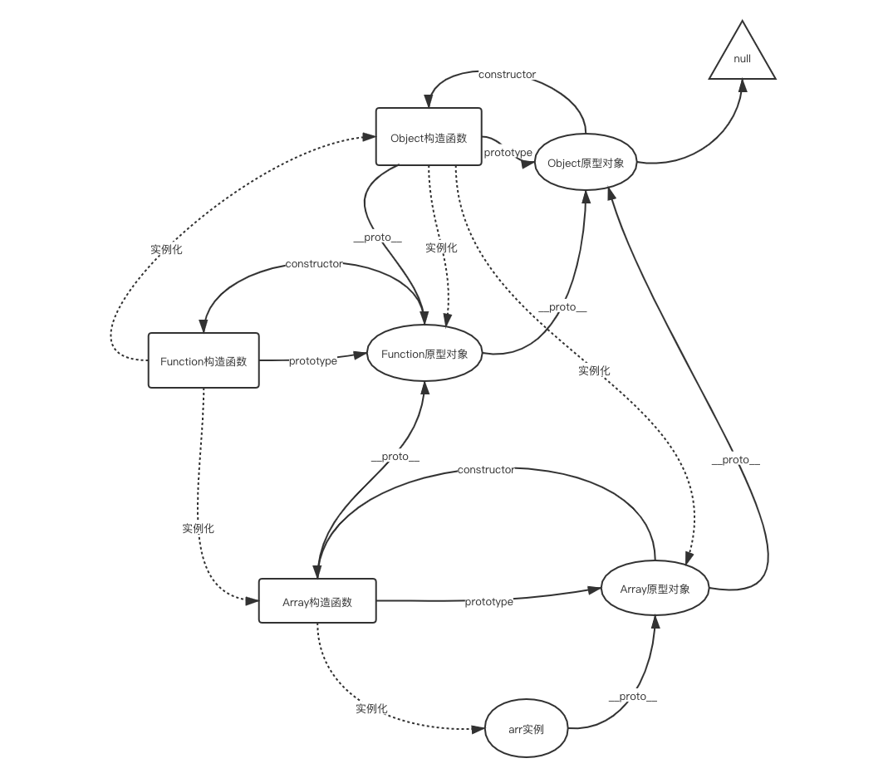
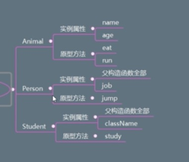

# <font color="#00F0CD">继承</font>    

### 概念
一、继承分为三个类：超类型，父类型，子类型。 
例如：`动物`，`狗`，`哈士奇`，对于`哈士奇`来说`动物`就是超类型，`狗`就是父类型，`哈士奇`就是子类型。对于`狗`来说，`动物`是父类型，`哈士奇`是子类型。  

二、让子类继承父类的资源  

### 继承的方式  
原型链继承、借用构造函数继承、组合继承、原型式继承、寄生式继承、寄生式组合继承、拷贝属性继承  

### 继承的意义  
优点： 减少代码冗余，方便统一操作  
弊端： 耦合性比较强  

### 原型链继承  
> 每个函数都能构造出一个对象，而这个对象的一个属性`__proto__`就是指向这个函数的原型对象；而原型对象本质也是一个对象，也是由另一个构造函数构造出来的，也指向那个构造函数的原型对象。以上形成一个链式结构，就称为原型链。  

* 我们需要牢记两点：①__proto__和constructor属性是对象所独有的；② prototype属性是函数所独有的，因为函数也是一种对象，所以函数也拥有__proto__和constructor属性。

* __proto__ 属性，它是对象所独有的，可以看到__proto__属性都是由一个对象指向一个对象，即指向它们的原型对象（也可以理解为父对象）__proto__属性的作用就是当访问一个对象的属性时，如果该对象内部不存在这个属性，那么就会去它的__proto__属性所指向的那个对象（父对象）里找，一直找，直到__proto__属性的终点null，再往上找就相当于在null上取值，会报错。通过__proto__属性将对象连接起来的这条链路即我们所谓的原型链。

* prototype属性的作用就是让该函数所实例化的对象们都可以找到公用的属性和方法，即f1.__proto__ === Foo.prototype。prototype属性，别忘了一点，就是我们前面提到要牢记的两点中的第二点，它是函数所独有的，它是从一个函数指向一个对象。它的含义是函数的原型对象
* constructor属性的含义就是指向该对象的构造函数，所有函数（此时看成对象了）最终的构造函数都指向Function。constructor属性也是对象才拥有的，它是从一个对象指向一个函数，含义就是指向该对象的构造函数，
画出数组对象完整原型链：  
 

### 寄生组合式继承 = 原型链继承 + 构造函数继承 +  寄生式继承    

按照下图的要求，手写继承：  

 
```js
function Animal(name, age) {
    this.name = name
    this.age = age
}

Animal.prototype.eat = function() {
    console.log('Animal => eat', this.name, this.age)
}

function Person(job, name, age) {
    // 构造函数继承：借助父类构造函数，将父类构造函数中的属性继承过来，记住一定要写在最上面，否则下方的子类属性`job`，将会在修改时被覆盖
    Animal.call(this, name, age)
    this.job = job
}

/** 
寄生组合式继承 ===>
原型链 + 寄生方式的继承：由于上面已经继承了父类的属性，此时需要继承父类原型对象上面的方法，
仅仅用原型链的继承方式，`Person.prototype = new Animal()`，会导致重复继承属性
的问题。所以需要创建一个构造函数`Temp1`来只继承父类的原型对象上面的方法，然后再将子
类的原型对象，利用原型链继承，继承`Temp1`，然后再将`Temp1`沟造出来的实例对象的
`constructor`属性指向子类构造函数
*/
function Temp1() {}
Temp1.prototype = Animal.prototype  
const personProtoType = new Temp1()
personProtoType.constructor = Person
Person.prototype = personProtoType

// 注意！！！！！！！！！！！ 子类的原型对象一定要写在继承后，否则将会修改被覆盖，找不到此方法
Person.prototype.jump = function() {
    console.log('Person => jump', this.name, this.age, this.job)
}

function Student(className, job, name, age) {
    Person.call(this, job, name, age)
    this.className = className
}

function Temp2() {}
Temp2.prototype = Person.prototype  
const studentProtoType = new Temp2()
studentProtoType.constructor = Student 
Student.prototype = studentProtoType
    
Student.prototype.study = function() {
    console.log('Student => study', this.name, this.age, this.job, this.className)
}  

const stu = new Student('人类', '上班', '张三', '17')
stu.eat()
stu.jump()
stu.study()
```