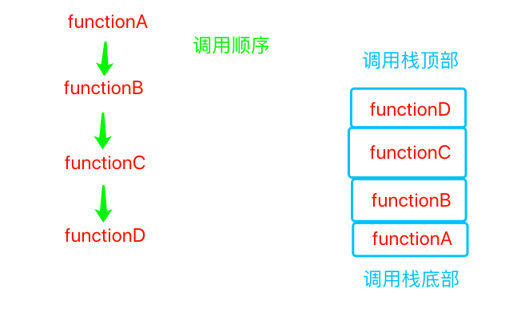

---
title: 调用栈
---  

# 调用栈   

#### 什么是调用帧？  

函数调用会在内存形成一个"调用记录"，又称"调用帧"（call frame），用于保存调用位置和内部变量等信息。

#### 什么是调用栈？  

假设有几个函数：functionA、functionB、functionC、functionD，然后逻辑是functionA调用functionB，functionB又调用functionC，functionC又调用functionD。则在functionD运行的时候，我们可以通过调用栈看到调用functionD的那几个函数是谁。  
根据调用顺序形成的调用帧，这四个函数形成了一个调用栈，最后被调用的函数放在栈顶，而最先被调用的函数放在栈底部，这就是调用栈（call stack）。  

   

#### 查看调用栈  

在debug面板 - sources - Call Stack
