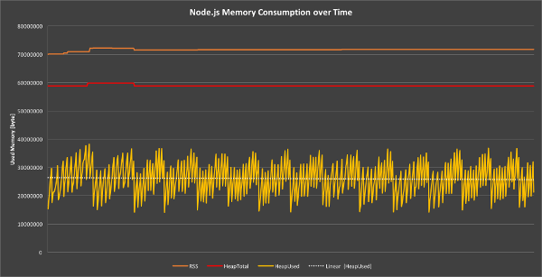

---
title: 内存泄露
---  

# <font color="#FF6347">内存泄露</font>

#### 什么是内存泄露？  

程序的运行需要内存。若程序提出要求时，操作系统或者在运行的时候就必须要提供内存供其运行。但是对于持续性的服务进程，如果不及时释放不再使用的内存，内存占用就会越来越高，影响系统性能，从而导致程序崩溃。  

对于不再使用到内存，没有得到及时的释放，这个就叫<font color="#FF6347">内存泄露</font>。  

#### 垃圾回收机制

现在许多语言都有垃圾回收机制，不需要程序员自己手动清除内存。  

垃圾回收机制是最常用的是根据`引用表`来判断这个内存是否需要回收的。语言引擎里面有一张引用表，用来保存内存里面所有资源的引用次数。如果一个值的引用次数为`0`，则证明这个值不再被用到了，则可以将这块内存释放。

但是有许多值明明不再引用，但是引用数却不为0，导致垃圾回收机制无法释放这块内存，导致内存泄露。  
例如：  

```js
const arr = [1, 2, 3, 4] // 变量arr的引用次数为1
console.log('内存泄露')
```   

上面的变量arr其实在后面的代码中并没有被使用，但是却因为[1, 2, 3, 4]是一个值，所以变量arr的引用次数为1，垃圾回收机制并不会释放这个内存，即使没有使用也会持续占用内存。   

但是若是将arr指向`null`，将引用指针为空，解除引用，垃圾回收机制则可释放内存。

```js
const arr = [1, 2, 3, 4]
console.log('内存泄露')
arr = null // 变量arr的引用次数为0
```   

#### 在Chorme浏览器中如何查看内存泄露？  

* 打开控制面板，选择Performance 
* 勾选 memory 
* 点击左上角录制按钮（record）
* 模拟用户操作程序  
* 一段时间后，点击 stop 按钮  

 面板会显示这段时间的内存占用情况   

如图：  
   
 
 
 

如果内存占用基本平稳，没有大波动，接近水平，则说明没有内存泄露；反之，则是内存泄露了。  

内存不存在泄露情况：  
    

内存泄露情况：  
   

#### 服务器环境下查看内存泄露    

使用Node提供的process.memoryUsage方法查看内存情况  

```js
conosle.log(process.memoryUsage())
```  
这个方法会返回一个对象  
```js
 {  
    rss: 27709440, // 所有内存占用，包括指令区和堆栈
    heapTotal: 5685248, // "堆"占用的内存，包括用到的和没用到的
    heapUsed: 3449392, // 用到的堆的部分
    external: 8772  // V8 引擎内部的 C++ 对象占用的内存
 } 
```   

判断内存泄漏，以`heapUsed`字段为准。  

#### 如何避免内存泄露  

* 减少不必要的全局变量  
* 使用完数据后，及时解除应用（闭包中的变量，dom引用，定时器清除）  
* 避免死循环，造成浏览器卡顿、崩溃的问题

