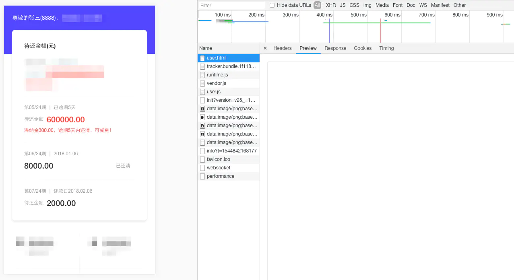
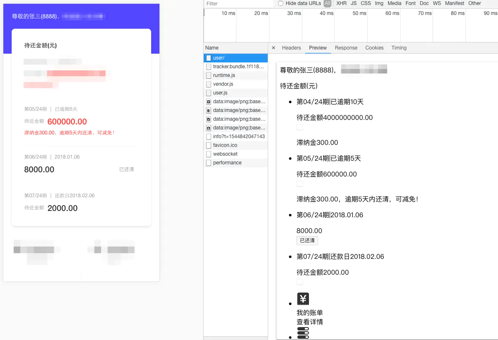
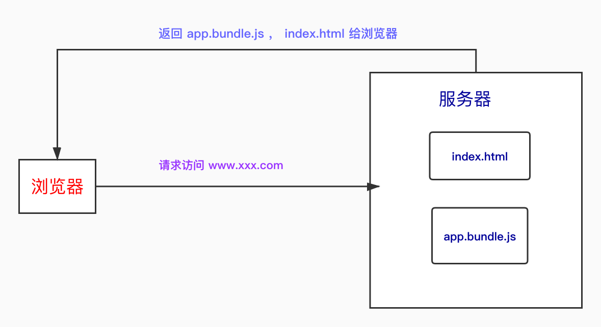
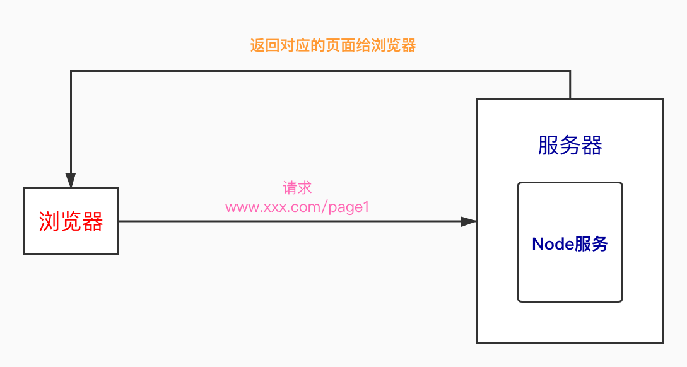

# ssr 服务端渲染

### 什么是 ssr ？

简单理解是将组件或页面通过服务器生成 html 字符串，再发送到浏览器，最后将静态标记"混合"为客户端上完全交互的应用程序

-   没使用服务渲染，当请求 user 页面时，返回的 body 里为空，之后执行 js 将 html 结构注入到 body 里，结合 css 显示出来

    

-   使用了服务端渲染，当请求 user 页面时，返回的 body 里已经有了首屏的 html 结构，之后结合 css 显示出来

    

### 纯浏览器渲染

用户在浏览器上输入网址，访问到的其实是服务器上的一个文件服务。服务器会返回给浏览器一堆文件，这些文件是你 `npm run build`打包之后生成的。其中`app.bundle.js`是你写的业务代码，而`index.html`里面是没有任何东西的，仅仅是引入了 JS 的模板。而浏览器渲染出来的页面都是通过执行 JS 来生成的，生成 html，生成 DOM。

### ssr 与 纯浏览器渲染的利弊

#### 纯浏览器渲染的缺点

-   不利于 `SEO`。`SEO`的根据是请求网站，看返回的 `html` 文件中有没有有价值的信息。搜索引擎是利用爬虫去爬取 `index.html` 中的关键词数据，但是在浏览器渲染中`index.html`文件爬不到任何价值信息。

*   首屏加载。 因为所有的业务组件信息都在`app.bundle.js`中，所以一旦要查看，就需要将这个文件加载完。无论是做异步组件，还是优化始终是没有直接加载 `html` 速度快的。
*   浏览器压力问题。纯浏览器渲染是  拿到返回的文件后，执行 `app.bundle.js`，通过`app.bundle.js`生成 `html`，在进行渲染，渲染过程中又需要发请求，再执行 `JS`重新生成 `html`。所有的工作都压在浏览器，浏览器需要处理的事情太多，所以会造成压力太大，内存占用过大，会卡崩。

####如何解决纯浏览器渲染的问题，为什么要用 ssr

<strong>核心问题：纯浏览器渲染，是需要执行 `JS`（`app.bundle.js`），再根据 `JS` 生成 `html` 页面。</strong>

<strong>问题解决：将 `JS` 的执行移到服务器去进行，减少客户端的压力，客户端只需直接接收服务端返回的 `html` 就可以了。</strong>

### ssr 渲染

#### 过程

浏览器请求访问某个页面，服务器接收到请求后，解析执行 `js` 生成 `html` 页面，将其返回给浏览器。比如`vue`，解析 `JS` 时，`JS` 里面全部都是`.vue`的文件，也就是 `vue` 实例，服务器就是要将这些实例转成字符串形式的 `html`

#### 为什么 `Node`

作为服务端语言，解析 `JS` 最好的肯定是 `Node` 了
