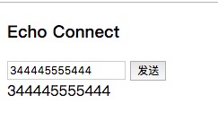
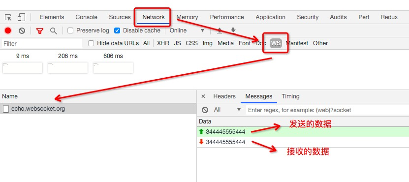

# <font color="#FFB6C1">一个简易的WebSocket</font>

WebSocket 是 HTML5 开始提供的一种在单个 TCP 连接上进行全双工通讯的协议。

WebSocket 使得客户端和服务器之间的数据交换变得更加简单，允许服务端主动向客户端推送数据。在 WebSocket API 中，浏览器和服务器只需要完成一次握手，两者之间就直接可以创建持久性的连接，并进行双向数据传输。

```html
<!DOCTYPE html>
<html lang="en">
<head>
    <meta charset="UTF-8">
    <meta name="viewport" content="width=device-width, initial-scale=1.0">
    <meta http-equiv="X-UA-Compatible" content="ie=edge">
    <title>一个简易的WebSocket</title>
</head>
<body>
    <h3>Connect</h3>
    <input id="sendTxt" type="text" />
    <button id="sendBtn">发送</button>
    <div id="mesgBox"></div>

    <script>
        const ws = new WebSocket('ws://echo.websocket.org/')
        ws.onopen = function() {
            console.log('已连接')
            document.getElementById('mesgBox').innerHTML = '已连接'
        }

        ws.onclose = function() {
            console.log('已断开链接')
        }
        
        // 当收到来自服务器的消息时调用的事件函数
        ws.onmessage = function(e) {
            console.log(e.data)
            document.getElementById('mesgBox').innerHTML = e.data
        }

        document.getElementById('sendBtn').onclick = function() {
            const txt = document.getElementById('sendTxt').value 
            
            // websocket发送数据
            ws.send(txt)
        }
    </script>
</body>
</html>
```

界面：  
  

控制台：  
  