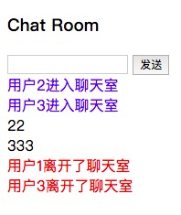

# <font color="#FFB6C1">一个简易的WebSocket</font>

WebSocket 是 HTML5 开始提供的一种在单个 TCP 连接上进行全双工通讯的协议。

WebSocket 使得客户端和服务器之间的数据交换变得更加简单，允许服务端主动向客户端推送数据。在 WebSocket API 中，浏览器和服务器只需要完成一次握手，两者之间就直接可以创建持久性的连接，并进行双向数据传输。

```html
<!DOCTYPE html>
<html lang="en">
<head>
    <meta charset="UTF-8">
    <meta name="viewport" content="width=device-width, initial-scale=1.0">
    <meta http-equiv="X-UA-Compatible" content="ie=edge">
    <title>一个简易的WebSocket</title>
</head>
<body>
    <h3>Connect</h3>
    <input id="sendTxt" type="text" />
    <button id="sendBtn">发送</button>
    <div id="mesgBox"></div>

    <script>
        const ws = new WebSocket('ws://echo.websocket.org/')
        ws.onopen = function() {
            console.log('已连接')
            document.getElementById('mesgBox').innerHTML = '已连接'
        }

        ws.onclose = function() {
            console.log('已断开链接')
        }
        
        // 当收到来自服务器的消息时调用的事件函数
        ws.onmessage = function(e) {
            console.log(e.data)
            document.getElementById('mesgBox').innerHTML = e.data
        }

        document.getElementById('sendBtn').onclick = function() {
            const txt = document.getElementById('sendTxt').value 
            
            // websocket发送数据
            ws.send(txt)
        }
    </script>
</body>
</html>
```

界面：  
  

控制台：  
    

-----------------------------------------  

### WebSocket Chat Room  

在上面的基础上改造代码 ↑  

```html
<!DOCTYPE html>
<html lang="en">
    <head>
        <meta charset="UTF-8" />
        <meta name="viewport" content="width=device-width, initial-scale=1.0" />
        <meta http-equiv="X-UA-Compatible" content="ie=edge" />
        <title>chat room</title>
    </head>
    <body>
        <h3>Chat Room</h3>
        <input id="sendTxt" type="text" />
        <button id="sendBtn">发送</button>

        <script>
            // 自己写ws服务端部分，连接3000端口
            const ws = new WebSocket('ws://localhost:3000/');
            const showMessage = (str, type) => {
                const div = document.createElement('div');
                div.innerHTML = str;

                switch (type) {
                    case 'enter':
                        div.style.color = 'blue';
                        break;
                    case 'leave':
                        div.style.color = 'red';
                        break;
                }
                document.body.appendChild(div);
            };
            ws.onopen = function() {
                console.log('已连接');

                // 连接成功才进行点击事件发送消息
                document.getElementById('sendBtn').onclick = function() {
                    const txt = document.getElementById('sendTxt').value;
                    txt && ws.send(txt);
                };
            };

            ws.onclose = function() {
                console.log('已断开链接');
            };

            // 当收到来自服务器的消息时调用的事件函数
            ws.onmessage = function(e) {
                console.log(e.data);

                let mes = JSON.parse(e.data)
                // 收到消息时，创建一个div来放消息
                showMessage(mes.data, mes.type);
            };
        </script>
    </body>
</html>

```  
wsServer.js 服务端部分， 使用了nodejs-websocket的插件来写

```js
const ws = require('nodejs-websocket');

const PORT = 3000;

let clientCount = 0; //客户端用户的计数器，用来区别用户名，例如 user1, user2, user3

var server = ws
    .createServer(function(conn) {
        console.log('New connection');

        // 每一次连接都让计数器加1
        clientCount++;
        conn.nickname = '用户' + clientCount;

        let mes = {
            type: 'enter',
            data: conn.nickname + '进入聊天室'
        };

        // 每一次连接都进行一次广播，广播谁谁谁进来了
        broadcast(JSON.stringify(mes));

        conn.on('text', function(str) {
            let mes = {
                type: 'message',
                data: str
            };
            // 广播消息
            broadcast(JSON.stringify(mes));
        });
        
        conn.on('close', function(code, reason) {
            console.log('Connection closed');

            let mes = {
                type: 'leave',
                data: conn.nickname + '离开了聊天室'
            };
            // 关闭时，广播谁谁谁离开了
            broadcast(JSON.stringify(mes));
        });
        conn.on('error', function(err) {
            console.log('handle err');
            console.log(err);
        });
    })
    .listen(PORT);

// 广播函数
function broadcast(str) {
    // 遍历所有连接，让所有联机的服务都进行广播，也就是都发送这个消息
    // server 下面有个 api,connections来获取所有连接
    server.connections.forEach(function(connection) {
        connection.sendText(str);
    });
}

console.log('websocket listening on port' + PORT);

```  

监听3000端口，`node wsServer.js`启动服务  

聊天室界面：  
  