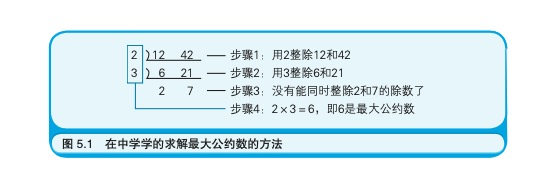
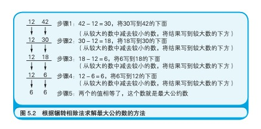
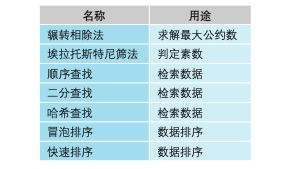
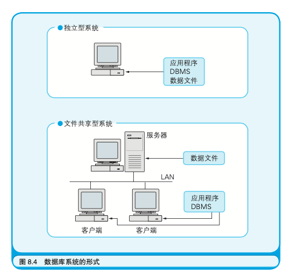
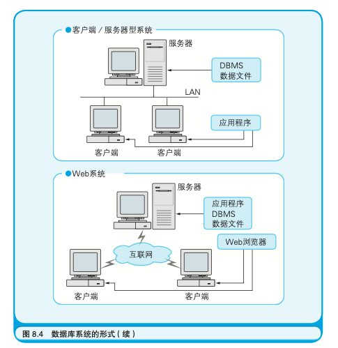

# <font color="#00E0CD">计算机是如何跑起来的</font>  

### 计算机三要素  
* <strong>CPU：中央处理器，负责解释和执行程序</strong>
* <strong>内存：沟通外存与CPU的桥梁。所有的程序都是在内存中运行</strong>
* <strong>I\O：input/output，输入/输出</strong>  

CPU负责解释和执行程序，数据从内存或者I/O进行输入，在CPU内部进行运算处理，再把运算结果输出到内存和I/O。内存中存放着程序，程序是数据和指令的集合。I/O中临时存放着用于与周边设备进行输入输出的数据。  

### 程序  
程序的三种流程：  
* <strong>顺序执行</strong>
* <strong>条件分支</strong>
* <strong>循环</strong>   

CPU中有各种各样的各司其职的寄存器。其中PC寄存器（程序计数器）主要是用于存储内存地址，该地址指向下一条即将执行的命令。每解释完一条命令，PC寄存器的值就会自动被更新为下一条指令的地址。

顺序执行是最基本的程序流程，因为CPU中的PC寄存器的值会自动更新。条件分支和循环，在高级语言中用程序块表示，在机器语言和汇编语言中用跳转指令表示，在硬件上是通过把PC寄存器的值设为要跳转到的目的地的内存地址来实现。

### 与算法成为好朋友的七个要点  
* <strong>算法中解决问题的步骤是明确且有限的</strong>
* <strong>计算机不靠直觉而是机械地解决问题</strong>   
例：求最大公约数  
学校中的解法：  
   
算法：  
   

* <strong>了解并应用典型算法</strong>（对于已经有经典算法解决的，可以用经典算法来直接解决）
    

* <strong>利用计算机的处理速度</strong>（有时候不要认为暴力解法很费时间，计算机计算可能也不过是一瞬间的事情）
* <strong>使用编程技巧提升程序执行速度</strong>（“哨兵”的理解）
* <strong>找出数字间的规律</strong>
* <strong>先在纸上考虑算法</strong>（画流程图就可以方便地把算法用图表示出来，因此请诸位大量地、 灵活地运用它。如果不想画流程图，也可以用语言把算法描述出来，先在纸上用文字或图表描述出解决问题的步骤，而不要立刻开始编写代码）  

### 成为会使用面向对象的程序员吧  
面向对象编程是一种基于以下思路的程序设计方法：将关注点置于对象本身，对象的构成要素包含对象的行为及操作，以此为基础进行编程。这种使程序易于复用，软件的生产效率得以提升。其中主要的编程技巧：继承，封装，多态。  

类和对象的关系：有了一个做饼干的模具（类），那么需要多少就能做出多少饼干（对象）  

```js
class Person {
    constructor(name, age) {
        this.name = name
        this.age = age
    }

    print() {
        console.log(this.name, this.age)
    }
}
```  

### 一会就用的数据库Database （数据Data，基地Base） 
* 数据库术语中“表”是什么意思？  
    答： 表(Table)就是被整理成表格形式的数据。
* DBMS是什么的简称？  
    答： BMS是Database Management System(数据库管理系统)的简称。市面上的 DBMS 有 SQL Server、Oracle、DB2 等。无 论是哪种 DBMS 都可以用基本相同的 SQL 语句操作。  
* 键和索引的区别是什么?  
    答： 用于设定表和表之间的关系( Relationship)， 而索引是提升数据检索速度的机制。其上每个值都能够唯一标识一条记录的字段称为主键。 为了在表和表之间建立关系而在表中添加的、其他表 主键的字段称为外键。而索引是与键无关的机制。    
* 数据库三要素是什么？  
    答：数据文件，DBMS，应用程序  

在小型系统中，把三个要素全部部 署在一台计算机上，称作`“独立型系统”`。 

在中型系统中，把数据文件 部署在一台计算机上，并且使数据文件被部署了 DBMS 和应用程序 的多台计算机共享，这样的系统被称为`“文件共享型系统”`。

在大型 系统中，把数据文件和 DBMS 部署在一台(或者多台)计算机上，然 后用户从另外一些部署着应用程序的计算机上访问，这样的系统被称 作`“客户端/服务器型系统”`。其中部署着数据文件和 DBMS 的计算 机是服务器(Server)，即服务的提供者;部署着应用程序的计算机是 客户端(Client)，即服务的使用者。

如果把服务器和客户端之间用互联网联结起来，就形成了 `Web 系统`。在 Web 系统中，一般情况下应 用程序也是部署在服务器中的，在客户端只部署 Web 浏览器


  
