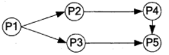
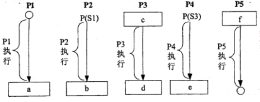
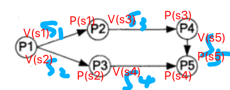
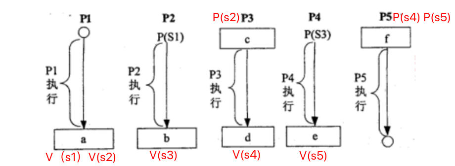
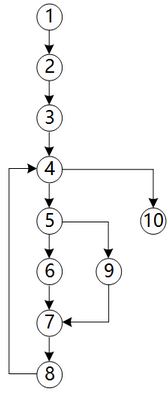
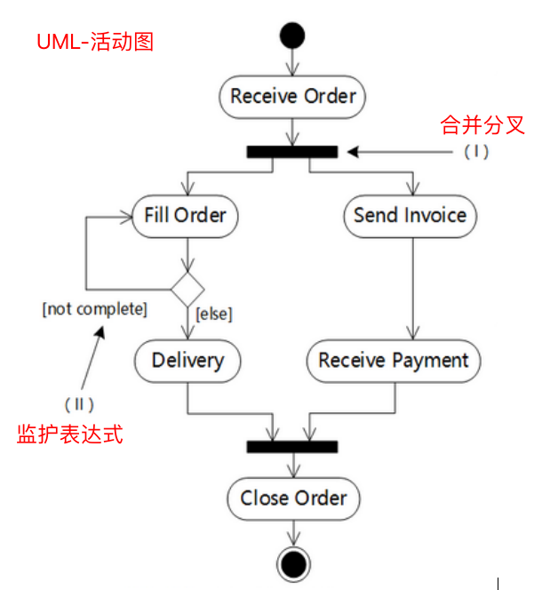
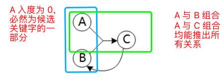
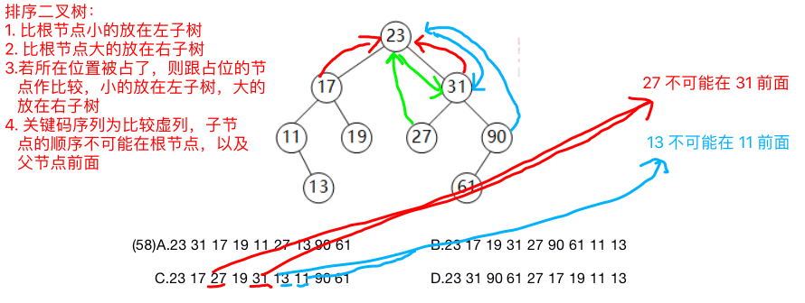
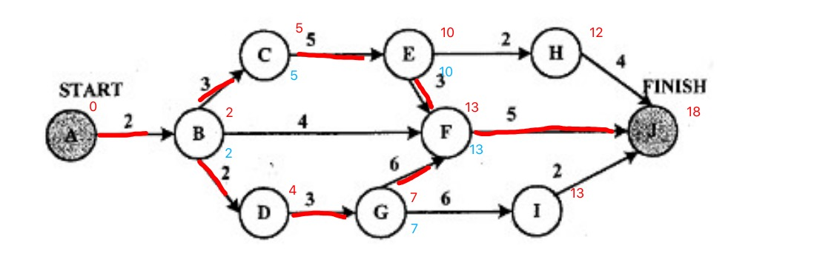
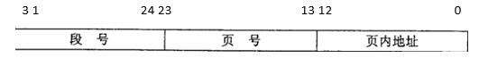

# <font color="#0004CD">Software Exam</font>

1. VLIW：<font color="#f00">超长指令字</font>(very long instruction word)
2. 主存与 cache 的地址映射方式中<font color="#f00">全相联</font>方式可以实现主存任意一块装入 cache 中的任意位置...
3. 移位指令中的<font color="#f00">左移一位</font>指令的操作结果相当于对操作数进行乘 2 操作

    ```
    移位运算符就是在二进制的基础上对数字进行平移

        << 左移
        >> 右移
        >>> 无符号右移

    在数字没有溢出的情况下，无论正数负数，左移 n 位相当于乘以 2 的 n 次方
    ```

4. 内存按字节编址，从 A1000H 到 B13FFH 的区域的存储容量为（ ）KB

    ```
    h - 代表十六进制
    d - 代表十进制
    b - 代表二进制

    B13FFH，A1000H 为十六进制数
    求差：B13FF - A1000 = 103FF
    单位转换：103FF / 1024 = 65
    ```

5. 关于总线的说法：
    - 并行总线适合近距离高速数据传输
    - 串行总线适合长距离数据传输
    - 专用总线在设计上可以与连接设备实现最佳匹配
    - <font color="#f00">单总线结构控制简单方便，控制方便，但由于所有设备部件均挂在单一总线上，只能分时工作，即同一时刻只能在两个设备间传送数据，传输效率和速度受到限制</font>
6. HTTPS = HTTP + SSL
7. 为了攻击远程主机，通常利用<font color="#f00">端口扫描</font>技术检测远程主机状态
    ```
    端口扫描器通过远程 TCP/IP 不同的端口的服务，并记录目标给予的回答，通过这种方法，可以搜集到很多关于目标主机的各种有用的信息
    ```
8. 某软件公司参与开发管理系统软件的程序员张某，辞职到另一公司任职，于是该项目负责人将该管理系统软件上开发者的署名更改为李某（接张某工作）。该项目负责人的行为<font color="#f00">侵犯了张某开发者身份权（署名权）</font>
    ```
    软件著作权人享有：
    a. 发表权
    b. 开发者身份权： 不随软件开发者的消亡而丧失，且无时间限制
    ```
9. 美国某公司与中国某企业谈技术合作，合同约定使用 l 项美国专利（获得批准并在有效期内），该项技术未在中国和其他国家申请专利。依照该专利生产的产品<font color="#f00">在中国销售，中国企业不</font>需要向美国公司支付这件美国专利的许可使用费。
    ```
    在中国不享有专利权，因此，不能禁止他人在中国 制造、使用、销售、进口、许诺销售。
    ```
10. 关于格式

    - <font color="#f00">WAV：声音文件格式</font>
    - BMP：标准图像文件格式
    - MP3：音频压缩格式
    - <font color="#f00">MOV：Quick Time 影片格式，是一种音频、视频文件格式</font>

11. 关于编辑  软件
    - PowerPiont：演示文稿软件 PPT
    - Premiere：视频编辑软件
    - <font color="#f00">Acrobat：PDF 编辑软件</font>
12. 使用 150DPI 的扫描分辨率扫描一幅 3×4 英寸的彩色照片，得到原始的 24 位真彩色图像的数据量是（ ）Byte。
    ```
    DPI：扫描分辨率单位，是多功能一体机在实现扫描功能时，通过扫描元件将扫描对象每英寸可以被表示成的点数。它的表示方式是用垂直分辨率和水平分辨率相乘表示。

    150DPI：相当于 150 * 150dpi 表示每英寸水平分辨率为 150点，垂直分辨率为150 点。

    总像素 = 3 * 4 * 150 * 150 
    数据量（bit）= 总像素 * 24
    单位转换（byte）= 数据量（bit）/ 8

    答案： 3 * 4 * 150 * 150 * 24 / 8
    ```
13. 在结构化分析中，用数据流图描述<font color="#f00">数据在系统中如何被传送或变换，以及如何对数据流进行变换的功能或子功能，用于对功能建模</font>。当采用数据流图对一个图书馆管理系统进行分析时，<font color="#f00">读者</font>是一个外部实体
14. 软件开发过程中，<font color="#f00">软件体系结构图</font>属于概要设计阶段的工作内容
15. 软件开发过程中，<font color="#f00">数据字典、流图、实体联系图</font>属于需求分析阶段的输出
16. 关于高级程序设计语言实现的编译和解释方式的叙述，<font color="#f00">编译程序不参与用户程序的运行控制，而解释程序参与</font>
    ```
    关于解释程序，编译程序，汇编程序：

    汇编程序（为低级服务）是将汇编语言书写的源程序翻译成由机器指令和其他信息组成的目标程序。
    解释程序（为高级服务）直接执行源程序或源程序的内部形式，一般是读一句源程序，翻译一句，执行一句，不产生目标代码
    编译程序（为高级服务）是将高级语言书写的源程序翻译成与之等价的低级语言的目标程序

    解释：程序运行时，取一条指令，将其换化为机器指令，再执行这条机器指令。（同声翻译）
    编译：程序运行时之前，将程序的代码编译成机器代码，再运行这个程序。 （全文翻译）生成中间代码，代码优化
    ```
17. 脚本语言主要采用<font color="#f00">解释方式</font>实现而非编译
18. 中间代码的表达形式有<font color="#f00">语法树，后缀式，三地址代码</font>
    ```
    每个三地址码指令，都可以被分解为四个元组（4-tuple）：（运算符，运算对象1，运算对象2，结果）。因为每个陈述都包含了三个变量，所以它被称为三地址码
    ```
19. 当用户通过键盘或鼠标进入某应用系统时，通常最先获得键盘或鼠标输入信息的是<font color="#f00">中断处理</font>程序。
    ```
    输入输出对于PC来说，就是中断、DMA方式为主，鼠标键盘就是中断方式。

    DMA(直接存储器访问) 是所有现代电脑的重要特色，它允许不同速度的硬件装置来沟通，而不需要依赖于 CPU 的大量中断负载。
    ```
20. 在Windows操作系统中，当用户双击“IMG_20160122_103.jpg”文件名时，系统会自动通过建立的<font color="#f00">文件关联</font>来决定使用什么程序打开该图像文件。
    ```
    当用户双击一个文件名时，Windows系统通过建立的文件关联来决定使用什么程序打开该文件。例如系统建立了记事本或写字板;程序打开扩展名为.TXT的文件关联，那么当用户双击Wang.TXT文件时，Windows先执行记事本或写字板程序，然后打开Wang．TXT文件
    ```
21. 某磁盘有100个磁道，磁头从一个磁道移至另一个磁道需要6ms。文件在磁盘上非连续存放，逻辑上相邻数据块的平均距离为10个磁道，每块的旋转延迟时间及传输时间分别为100ms和20ms，则读取一个100块的文件需要（ ）ms。
    ```
    滑到相邻逻辑块的时间为 T1 = 6 * 10
    读取与传输时间 T2 = 100 + 20
    滑到目标块以及读取总共时间为 T1 + T2
    则 100 块的时间 T = 100 * （T1 + T2）

    答案：100 * （6 * 10 + 100 +20）
    ```
22. 若用PV操作控制进程P1、P2、P3、P4和P5并发执行的过程，则需要设置5个信号S1、S2、S3、S4和S5，且信号量S1～S5的初值都等于零。下图中a和b处应分别填（ ）；c和d处应分别填写（ ）；e和f处应分别填写（ ）。

      
       

    ```
    解题要点：

    在第一张图上
    a. 先将信号按照从上至下，从左至右标记出来
    b. 记住一个准则：在进程开始端始终为 V()，结束端始终为 P()

    在第二张图上
    c. 下层部分都是 V()开始，上层部分都为 P()结束
    d. 再根据前面的准则进行判断，即可得出答案
    ```  
     
       
23. 耦合类型：
    * 内容耦合：  
      * 一个模块直接访问另一个模块的内部数据
      * 一个模块不通过正常入口转到另一模块内部
      * 两个模块有一部分程序代码重迭(只可能出现在汇编语言中)
      * 一个模块有多个入口
    * <font color="#f00">公共耦合：若一组模块都访问同一个公共数据环境，则它们之间的耦合就称为公共耦合。公共的数据环境可以是全局数据结构、共享的通信区、内存的公共覆盖区等</font>
    * 外部耦合：一组模块都访问同一全局简单变量而不是同一全局数据结构，而且不是通过参数表传递该全局变量的信息，则称之为外部耦合
    * 控制耦合：如果一个模块通过传送开关、标志、名字等控制信息，明显地控制选择另一模块的功能，就是控制耦合
    * 标记耦合：一组模块通过参数表传递记录信息，就是标记耦合。这个记录是某一数据结构的子结构，而不是简单变量
    * 数据耦合：一个模块访问另一个模块时，彼此之间是通过简单数据参数 (不是控制参数、公共数据结构或外部变量) 来交换输入、输出信息的
    * 非直接耦合：两个模块之间没有直接关系，它们之间的联系完全是通过主模块的控制和调用来实现的
24. 在设计软件的模块结构时，<font color="#f00">模块的功能越单纯越好不能</font>改进设计质量
25. 软件体系结构的各种风格中，仓库风格：
    * 优点
        * 解决问题的多方法性
        * 具有可更改性和可维护性
        * 有可重用的知识源
        * 支持容错性和健壮性  
    * 缺点
        * <font color="#f00">测试困难</font>
        * 不能保证有好的求解方案
        * 效率低
        * 开发成本高
        * 缺少对并行机的支持  
    * 仓库风格包括：
        * 数据库系统
        * 黑板系统
        * 超文本系统  
    * <font color="#f00">编译器</font>不属于仓库风格
26. 关于测试策略： 
    * 三明治：自顶向下和自底向上两种方式的结合
        * 优点：  
            * 较早地验证了主要的控制和判断点
            * 较早的验证给了底层模块
            * 测试的并行程度较高
27. 采用McCabe度量法计算下图所示程序的环路复杂性为（ ）  

     
    ```
    解题要点：

    套公式 复杂性 = 节点之间边数（m）- 节点数（n）+ 2

    答案：11 - 10 + 2 = 3
    ```  
28. 在面向对象方法中，<font color="#f00">继承</font>是父类和子类之间共享数据和方法的机制。子类在原有父类接口的基础上，用适合于自己要求的实现去置换父类中的相应实现称为<font color="#f00">覆盖</font>。
    ```
    封装：信息隐藏，是指利用抽象数据类型将数据和基于数据的操作封装在一起，使其构成一个不可分割的独立实体，数据被保护在抽象数据类型的内部，尽可能地隐藏内部的细节，只保留一些对外接口使之与外部发生联系。
    ``` 
29. 在UML用例图中，参与者表示<font color="#f00">人、硬件或其他系统可以扮演的角色</font>
    ```
    参与者：指存在于系统外部并直接与系统进行交互的人、系统、子系统或类的外部实体的抽象
    ``` 
30. UML中关联是一个结构关系，描述了一组链。两个类之间<font color="#f00">可以有多个由不同角色标识的</font>关联 
31. 关于 UML图的判断： 

    
32. 为图形用户界面（GUI）组件定义不同平台的并行类层次结构，适合采用<font color="#f00">外观</font>模式
    ```
    Facade（外观）模式：为子系统中的各类（或结构与方法）提供一个简明一致的界面，隐藏子系统的复杂性，使子系统更加容易使用。它是为子系统中的一组接口所提供的一个一致的界面。
    ``` 
33. <font color="#f00">命令</font>设计模式将一个请求封装成一个对象，从而使得可以用不同的请求参数化，队请求派对活记录请求日志，以及支持可撤销的操作
34. <font color="#f00">观察者</font>设计模式最适合用于发布/订阅消息模型，即当订阅者注册一个主题后，此主题有新消息到来时订阅者就会收到通知
    ```
    观察者模式：定义对象间的一种一对多的依赖关系，当一个对象的状态发生改变时，所有依赖于它的对象都得到通知并自动更新
    ```
35. 因使用大量的对象而造成很大的存储开销时，适合采用<font color="#f00">享元</font>模式进行对象共享，以减少对象数量从而达到较少的内存占用并提升性能
    ```
    享元模式提供支持大量细粒度对象共享的有效方法
    ```
36. 移进-归约分析法是编译程序（或解释程序）对高级语言源程序进行语法分析的一种方法，属于<font color="#f00">自底向上（或自下而上）</font>的语法分析方法
37. 传值与传址（传引用）的区别：
    * 在传值中函数参数压栈的是参数的副本，任何的修改是在副本上作用，没有作用在原来的变量上
    * 传址中压栈的是指针变量的副本，当你对指针解指针操作时，其值是指向原来的那个变量，所以对原来变量操作
38. 数据的物理独立性和逻辑独立性分别是通过修改<font color="#f00">模式与内模式之间的映像、外模式与模式之间的映像</font>来完成的
    ```
    数据库的“三级模式”：

    概念模式（也称模式）：是数据库中全部数据的逻辑结构和特征的描述，由若干个概念记录类型组成，只涉及型（对某一数据的结构和属性的说明）的描述，不涉及具体的值（具体赋值）

    外模式（也称用户模式，子模式）：是用户与数据库系统的接口，是用户用到的那部分数据的描述，由若干个外部记录类型组成。用户使用数据操纵语言对数据库进行操作，实际上是对外模式的外部记录进行操作

    内模式（也称存储模式）：是数据物理结构和存储方式的描述，是数据在数据库内部的表示方式，定义所有的内部记录类型、索引和文件的组织方式，以及数据控制方面的细节

    总之，数据按外模式的描述提供给用户，按内模式的描述存储在磁盘上，而概念模式提供了连接这两级模式的相对稳定的中间层，并使得两级中任意一级的改变都不受另一级影响

    数据库系统在三级模式之间提供了“两级映像”：

    模式/内模式映像：存在于概念级和内部级之间，实现了概念模式与内模式之间的相互转换
    外模式/模式映像：存在于外部级和概念级之间，实现了外模式与概念模式之间的相互转换

    正因为这两级映像，才保证了数据库中的数据具有较高的逻辑独立性和物理独立性
    ```
39. 关系规范化在数据库设计的<font color="#f00">逻辑设计</font>阶段进行
    ```
    数据库设计中规范化是在逻辑设计阶段进行的一项工作，该工作负责把关系模式进行规范，以减少冗余，以及一定程度上消除修改异常，插入异常及删除异常
    ```
40. 若给定的关系模式为R，U={A,B,C}，F = {AB→C,C→B}，则关系R（ ）。
    ```
    解题要点：
    a. 先将关系图画出
    b. 再根据入度，或者组合看是否可以得出所有关系
    c. 如果可以推出所有关系，则可以确定候选键
    d. 关键字的那几个就是主属性
    ```  
        
     关系 R <font color="#f00">候选关键字有 AB 和 AC，有 A、B、C三个主属性</font>
41. 设有二叉排序树（或二叉查找树）如下图所示，建立该二叉树的关键码序列不可能是（ C ）

    
42. 默认情况下，FTP服务器的控制端口为<font color="#f00">21</font>，上传文件时的端口为<font color="#f00">20</font>
    ```
    FTP协议占用两个标准的端口号：20和21，其中20为数据口，21为控制口

    FTP（File Transfer Protocol，文件传输协议） 是 TCP/IP 协议组中的协议之一。FTP协议包括两个组成部分，其一为FTP服务器，其二为FTP客户端。
    
    FTP服务器用来存储文件，用户可以使用 FTP 客户端通过 FTP 协议访问位于 FTP 服务器上的资源。
    ```
43. 使用ping命令可以进行网络检测，在进行一系列检测时，按照由近及远原则,首先执行的是<font color="#f00">ping127.0.0.1</font>
    ```
    查错误时，使用由近及远的原则意味着先要确认本机协议栈有没有问题，所以可以用ping127.0.0.1来检查本机TCP/IP协议栈，能PING通，说明本机协议栈无问题
    ```
44. 已知 IP地址为 193.6.7.0，求子网掩码以及默认网关，默认广播地址。
    ```
    解：
    a. 先判断 IP 地址是哪一个分类？

    A类地址：网络号 8 位，主机号 24 位
    1.0.0.0 到126.0.0.0
    0.0.0.0 和127.0.0.0保留

    B 类地址：网络号 16 位，主机号 16 位
    128.1.0.0到191.254.0.0
    128.0.0.0和191.255.0.0保留

    C 类地址：网络号 24 位，主机号 8 位
    192.0.1.0 到223.255.254.0
    192.0.0.0和223.255.255.0保留

    D 类地址
    224.0.0.0到239.255.255.255用于多点广播

    E 类地址
    240.0.0.0到255.255.255.254保留
    255.255.255.255用于广播

    所以得知 193.6.7.0为 C 类地址

    b. 根据类别得 C 类网络号为 24 位，主机号为 后 8 位，将网络号全部设为 1，主机号设为 0 则得到子网掩码
    11111111.11111111.11111111.00000000 => 255.255.255.0
    （注意如果IP地址为 193.6.7.0/26，则是告诉你网络前缀为 26 位，则只有后 6 位才是主机号，则子网掩码为11111111.11111111.11111111.11000000）

    c. 默认网关就是将IP地址的主机位除了最后一位，其它全部置为 1
    193.6.7.11111110 => 193.6.7.254

    d. 默认广播地址是将IP地址的主机位全部置为 1
    193.6.7.11111111 => 193.6.7.255
    ```
45. 在程序运行过程中，CPU需要将指令从内存中取出并加以分析和执行。CPU依据<font color="#f00">指令周期的不同阶段</font>来区分在内存中以二进制编码形式存放的指令和数据
    ```
    指令和数据是都存储在内存中，传统计算机CPU在执行过程中根据指令周期的不同阶段来区分是指令还是数据，取指周期取出的是指令，执行周期取出的是数据
    ```
46. 计算机在一个指令周期的过程中，为从内存读取指令操作码，首先要将<font color="#f00">程序计数器（PC）</font>的内容送到地址总线上。
    ```
    程序计数器是用于存放下一条指令所在单元的地址。当执行一条指令时，处理器首先需要从程序计数器中取出指令在内存中的地址，通过地址总线寻址获取
    ```
47. 如果浮点数的阶码(包括1位阶符)用R位的称码表示，尾数(包括1位数符)用M位的补码表示，则浮点数表示的数值范围如下：    
    
    最大正数: $(1-2^{-M+1}) * 2^{{2^{R-1}-1}}$  
    最小负数：$-1 * 2^{{2^{R-1}-1}}$
48. 已知数据信息为16位，最少应附加（ ）位校验位，以实现海明码纠错  
    海明校验码公式：  
    $2^r {\geq} x + r + 1$  

    ```
    其中 r 为校验码位数， x 为信息位位数
    所以 数据位为 16 位时，需要 r = 5 位校验位
    ```
49. 将一条指令的执行过程分解为取指、分析和执行三步，按照流水方式执行，若取指时间t取指=4△t、分析时间t分析=2△t、执行时间t执行=3△t，则执行完100条指令，需要的时间为（ ）△t
    ```
    需要时间 = 一条指令完整时间 + 剩余指令条数 * 周期
    周期为耗时最多的流程时间

    答案：T = 4△t + 2△t + 3△t + (100-1) * 4△t = 405△t
    ```
50. 在程序的执行过程中，Cache与主存的地址映射是由<font color="#f00">硬件自动完成</font>的
51. 关于加密算法：  
    * IDEA算法和RC4算法都对称加密算法，只能用来进行数据加密。
    * MD5算法是消息摘要算法，只能用来生成消息摘要无法进行数字签名。
    * RSA算法是典型的非对称加密算法，主要具有数字签名和验签的功能（记忆要点 RSA => sign）
52. 在网络设计和实施过程中要采取多种安全措施，其中<font color="#f00">漏洞发现与补丁管理</font>是针对系统安全需求的措施
53. 根据《中华人民共和国商标法》第三十八条：注册商标有效期满，需要继续使用的，应当在期满前六个月内申请续展注册。专利权和著作权到期后都无法延长，而商业秘密权无期限限制
54. 在审查过程中，对于不同的申请人同日 （指申请日，有优先权的指优先权日） 就同样的发明创造分别提出专利申请，并且这两件申请符合授予专利权的其他条件的，应当根据专利法实施细则第四十一条第一款的规定，通知申请人自行协商确定申请人
55. 按照商标法的规定，第29条，以及实施条例19条规定，同一天申请的，初步审定并公告使用在先的。驳回其他人的申请。均未使用获无法证明的，各自协商，不愿协商或者协商不成的，抽签决定，不抽签的，视为放弃
56. 在FM方式的数字音乐合成器中，改变数字载波频率可以改变乐音的<font color="#f00">音调</font>，改变它的信号幅度可以改变乐音的<font color="#f00">音高</font>
57. 关于结构化开发方法：  
    * 体系结构设计：主要是指要开发的系统中包含哪些部件，这些部件与部件之间的关系就是体系结构的设计。
    * 数据设计：也称为数据库设计，主要包含数据库的设计和这个数据所包含的核心表的设计。
    * 接口设计：用于子系统和模块之间或者内部系统和外部系统之间的各种交互，如功能描述，输入输出的定义，错误处理的设计。
    * <font color="#f00">过程设计：也称为模块详细设计，主要是详细模块的实现算法，以及模块所使用的数据结构。</font>
58. 关于敏捷开发方法：  
    * 极限编程XP：近似螺旋的开发方法，把整个开发过程分解为相对比较小而简单的周期，通过大家积极的沟通反馈，开发人员和客户都比较清楚当前的开发进度、需要解决的问题等等，根据这些实际情况去调整开发过程，这是极限编程的思想
    * 水晶法：不同的项目需要不同的开发方法
    * <font color="#f00">并列争球法：就是我们通常所说的Scrum。Scurm是一个增量、迭代的开发过程。产品团队总是先开发对客户具有较高价值的需求</font>
59. 某软件项目的活动图如下图所示，其中顶点表示项目里程碑，连接顶点的边表示包含的活动，边上的数字表示相应活动的持续时间（天），则完成该项目的最少时间为（ ）天。活动BC和BF最多可以晚开始（ ）天而不会影响整个项目的进度
    ```
    解题要点：
    a. 先推算出最早完成时间
    b. 标记处关键路径
    c. 根据关键路径来推算活动的最晚开始时间，也就是工期

    最少时间 18 天
    BC 工期 = C 点最晚时间 - 前面工期 = 5 - 3 - 2 = 0
    BF 工期 = F 点 最晚时间 - 前面那工期 = 13 - 4 - 2 = 7
    ```  
     
60. 常用的函数参数传递方式有传值与传引用两种，<font color="#f00">在传引用方式下，修改形参实质上改变了实参的值</font>
    ```
    传值调用最显著的特征就是被调用的函数内部对形参的修改不影响实参的值
    引用调用是将实参的地址传递给形参，使得形参的地址就是实参的地址
    ```
61. 实时操作系统主要用于有实时要求的过程控制等领域。实时系统对于来自外部的事件<font color="#f00">必须在被控对象规定的时间内做出及时响应并对其进行处理。</font>    

    实时操作系统是保证在一定时间限制内完成特定功能的操作系统。实时操作系统有硬实时和软实时之分。  
    * 硬实时要求在规定的时间内必须完成操作，这是在操作系统设计时保证的
    * 软实时则只要按照任务的优先级，尽可能快地完成操作即可
62. 假设段页式存储管理系统中的地址结构如下图所示，则系统最多可有（ ）个段，每个段的大小均为（ ）个页，页的大小为（ ）K  

    
    ```
    根据图可求出：
    页内地址长度：12 - 0 + 1 = 13位（求出每一页的大小）
    页号地址长度：23 - 13 + 1 = 11 位（可求出最多有多少页）
    段号地址长度：31 - 24 + 1 = 8（可求出最多有多少段）
    ```  
    答案： 系统最多有 $2^8 = 256$个段，每个段的大小 均为 $2^{11} = 2048$个页，每一页的大小为 $2^{13} {\div} 8 {\div} 1024 = 1k$，页总大小 $1 {\times} 8 = 8k$
