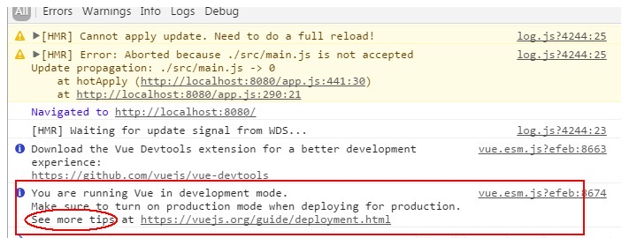

# <font color="#CBA500">Vue</font>

> 此为记录一次系统培训所整理的知识点

### MVVM

本质上就是解决了前端程序员大量繁琐的操作 DOM 的问题，数据的请求获取依然依赖于 Ajax 技术，但是数据获取后的展示，不再是操作 DOM，而是交由中间的 VM 层来处理。实现了前后端工程及数据的彻底分离。

### 响应式原理

Vue 最独特的特性之一，就是<strong>非侵入性的响应式系统</strong>

#### 什么是响应式？

简单来说，就是数据发生变化时，会重新对页面渲染。

#### 如何做出数据与视图之间的响应？

1. Vue 会对我们定义的数据`data`进行数据劫持
2. 然后对`data`进行逻辑处理（setter，getter）
3. 通过观察者`Watcher`来监听到数据的变化
4. 发布阶段，通知组件更新
5. 组件重新渲染

### 计算属性 Computed

在模板数据中，如果需要有复杂的逻辑处理，都应当使用计算属性。  
例如：

```html
<div id="example">
    {{ message.split('').reverse().join('') }}
</div>
```

这个地方的模板已不再是简单的声明式逻辑。如果要多次引用这个值时，则会变得难以处理，应使用计算属性来获取。

```js
<div id="example">
{{ reversedMsg }}
</div>

computed: {
    reversedMsg: function() {
        return this.message.split('').reverse().join('')
    }
}
```

### 监听器 Watch

当你有一些数据需要随着其它数据变动而变动时，可以使用监听器来处理。

```js
<div id="example">
{{ fullName }}
</div>

computed: {
    firstName: function(val) {
        this.fullName = val + '' + this.lastName
    }
    lastName: function(val) {
        this.fullName = firstName + '' + val
    }
}
```

> 如果数据依赖于其他数据，那么把这个数据设计为 computed；如果需要在某个数据变化时做一些事情，则使用 watch 来观察这个数据变化；当需要在数据变化时执行异步或开销较大的操作时，使用 watch 是最有用的。

### 生命周期

-   <strong>beforeCreate</strong>：实例初始化之后，此时的数据观察和事件机制都未形成，不能获得 DOM 节点。
-   <strong>created</strong>：在这个阶段 vue 实例已经创建，能获取到数据，但不能获取 DOM 元素。
-   <strong>beforeMount</strong>：依然得不到具体的 DOM 元素，但 vue 挂载的根节点已经创建。
-   <strong>mounted</strong>：在这个阶段，数据和 DOM 都已被渲染出来。通常请求数据会在该阶段。
-   <strong>beforeUpdate</strong>：在数据更新之前时调用。
-   <strong>updated</strong>：在数据更新之后时调用。
-   <strong>beforeDestroy</strong>：实例销毁之前调用。此时，实例仍然是可用的。
-   <strong>destroyed</strong>：vue 实例销毁后调用。调用后，vue 实例指示的所有东西都会解绑，所有的时间监听器会被卸载移除，所有的子实例也会被销毁。

### 组件

-   命名：可以为 `my-component-name` 也可以为 `MyComponentName`
-   模板内插入组件时：用`my-component-name`命名的，必须为`<my-component-name />`；用`MyComponentName`命名的，则`<my-component-name />`或者`<MyComponentName />` 都可以

### 插件

#### 两个重要的 api

-   Vue.use( args) 全局方法使用插件，需要在调用 new Vue() 启动应用之前完成  
    其实 Vue.use(args)就是去执行一个方法，它会去寻找你传入的参数`args`是否有`install`属性，如果有的话，会执行`install`属性里面的方法。如果没有`install`属性，则会去判断 args 是不是一个方法，如果是的，则直接执行这个方法。

-   Vue.mixin() 全局混入方法，数据，生命周期；主要提供逻辑复用，如果每个组件都需要在某个生命周期，要进行一个重复的操作，就可以通过这个方法混入，达到全局复用的目的。

```js
let a = {
    install: function(vue) {
        // 全局混入方法和数据
        vue.mixin({
            // 生命周期混入
            beforeCreate: function() {
                console.log('这句话会在组件渲染前执行');
            },

            // 在其他的组件里面调用时可以直接用 this.jump, this.isShow
            methods: {
                jump: function() {
                    // doSth
                }
            },
            data: function() {
                return {
                    isShow: true
                };
            }
        });
    }
};

Vue.use(a);
```

### 项目复盘

-   `Vue.config.productionTip`: 布尔值，是否启动生产消息  
    
-   使用`WebViewJavascriptBridge`与原生进行交互 (重点代码如下))

```js
function setupWebViewJavascriptBridge(callback) {
    if (window.WebViewJavascriptBridge) {
        return callback(WebViewJavascriptBridge);
    }
    if (window.WVJBCallbacks) {
        return window.WVJBCallbacks.push(callback);
    }
    window.WVJBCallbacks = [callback]; // 创建一个 WVJBCallbacks 全局属性数组，并将 callback 插入到数组中。
    var WVJBIframe = document.createElement('iframe'); // 创建一个 iframe 元素
    WVJBIframe.style.display = 'none'; // 不显示
    WVJBIframe.src = 'wvjbscheme://__BRIDGE_LOADED__'; // 设置 iframe 的 src 属性
    document.documentElement.appendChild(WVJBIframe); // 把 iframe 添加到当前文导航上。
    setTimeout(function() {
        document.documentElement.removeChild(WVJBIframe);
    }, 0);
}

// 这里主要是注册 OC 将要调用的 JS 方法。
setupWebViewJavascriptBridge(function(bridge) {});

// 这里主要是注册 OC 将要调用的 JS 方法。
setupWebViewJavascriptBridge(function(bridge) {
    // 声明 OC 需要调用的 JS 方法。
    bridge.registerHanlder('testJavaScriptFunction', function(
        data,
        responseCallback
    ) {
        // data 是 OC 传递过来的数据.
        // responseCallback 是 JS 调用完毕之后传递给 OC 的数据
        alert('JS 被 OC 调用了.');
        responseCallback({ data: 'js 的数据', from: 'JS' });
    });
});
```
* `require.context`的应用   
   > 一个 webpack 的 api,通过执行require.context函数获取一个特定的上下文,主要用来实现自动化导入模块,在前端工程中,如果遇到从一个文件夹引入很多模块的情况,可以使用这个api,它会遍历文件夹中的指定文件,然后自动导入,使得不需要每次显式的调用import导入模块  
```js
/**
* @param { String } directory 读取文件的路径
* @param { Boolean } useSubdirectories 是否遍历文件的子目录
* @param { RegExp } regExp 匹配文件的正则
*/
require.context(directory, useSubdirectories = false, regExp = /^.//);

// 举例：遍历当前文件夹下的所有.js 结尾的文件，不遍历子目录
const files = require.context('.', false, regExp = /.js$/);

let res = []
files.keys().froEach(key => {
    if(key === './index.js') return
    let item = files(key).default
    res = res.concat(item)
})
export default res
```
> require.context 返回的是一个函数，并且这个函数有 3 个属性  
    * resolve: Function 接收一个参数，参数为该文件夹下面匹配文件的相对路径，返回这个文件相对于整个工程的相对路劲
    * keys: Function 返回匹配成功模块的名字组成的数组
    * id: String 执行环境的 id，返回的是一个字符串，主要用于 module.hot.accept

   
