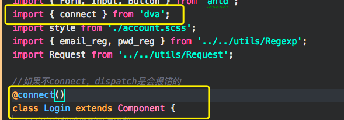

<!--
 * @Description: React Bug
 * @Date: 2019-07-05 09:48:10
 * @LastEditTime: 2019-10-10 09:35:46
 -->

# React

#### 1. _shouldComponentUpdate_

答：（props,state 有更新，是否出触发）这个周期函数必须返回一个布尔值，否则会报错，并且必须写在父容器（父组件），否则无效。

#### 2. _使用`ant-design`时，UI 组件上设置`className={style.xxx}`时，样式无效_

答：如果是修改 UI 组件的样式，需设置为`className="xxx"`，在全局中修改即可生效（:global{...})

#### 3. _在 dva 中使用`this.props.dispatch`报错 \_this.props.dispatch is not a function_

答：引入`connect`,然后再在 `class XXX extends component`上面写`@connect`即可



#### 4. ReactJs 项目本地测试出错：_Failed to compile Module not found does not match the corresponding path on disk_

答：看下是具体哪个文件不匹配名字，手动改下即可

#### 5. _子组件中打印`this.props`为空对象？_

答：因为父组件中没有传递`props`给子组件，所以子组件拿不到...在父组件中传递`props`过来即可。

#### 6. _当使用`antd + dva`时，路由和导航组件无法共同绑定切换_

答： 使用`antd`中的`selectedKeys`来实现这个功能，原理是`selectedKeys`是个数组，数组里面的值是什么，`url`上的路由路径就是什么，导航组件就会展示那个页面。所以我们要根据`this.props.location.path`来拿到路由的路劲，然后我们在赋值给`selectedKeys`，在页面组件加载完成时`componentDidMount`进行调用。但是会出现另外一个小问题，此时还应该在`UNSAFE_componentWillReceiveProps`中调用下这个方法，就是当`props`发生变化时，也需调用这个方法。

```js
//先定义
    constructor(props) {
        super(props)
        this.state = {
        collapsed: false,
        selectedKeys: []
        };
    }
```

```js
//在导航组件中添加此属性
<Menu
    defaultSelectedKeys={['welcome']}
    selectedKeys={this.state.selectedKeys}
    defaultOpenKeys={['sub1']}
    mode="inline"
    theme="dark"
>
    .......
</Menu>
```

```js
//定义方法，拿到 url 路由路径，并赋值给 selectedKeys
  handleSelectKeys = (pathname) => {
    const temp = pathname.split('/')
    const key = temp && temp.length < 2 ? 'welcome' : temp[1]
    this.setState({
      selectedKeys: [key]
    })
  }

//在两个生命周期中都要进行调用
  componentDidMount() {
    this.handleSelectKeys(this.props.location.pathname)
  }

  UNSAFE_componentWillReceiveProps(nextProps) {
    const { props } = this.props
    if (nextProps !== props) {
      this.handleSelectKeys(nextProps.location.pathname)
    }
  }
```

#### 7. _使用`antd`导航栏无选中效果_

答：检查没有效果的导航菜单项目，是不是`key`没有设置好。

```js
<Menu.Item key="admin">
    <Link to="/admin">
        <Icon type="inbox" />
        <span>管理</span>
    </Link>
</Menu.Item>
```

#### 8. 根据下拉框来进行条件渲染时，始终无法加载对应的组件？

答：无状态组件是无法加载的，必须是有状态组件，另外设置状态必须是用`this.setState`来进行设置，否则无法更改状态。
改变下拉框选项值利用`onChange`方法来拿到值，再利用这个值来进行不同组件的渲染。记得要在结构中调用这个方法。

```js
//下拉框
<Select
    placeholder="请选择"
    defaultValue="改变DOM"
    allowClears
    style={{ width: 465 }}
    onChange={this.handleChangeDom}
>
    <Select.Option key="0">DOM0</Select.Option>
    <Select.Option key="1">DOM1</Select.Option>
    <Select.Option key="2">DOM2</Select.Option>
    <Select.Option key="3">DOM3</Select.Option>
    <Select.Option key="4">DOM4</Select.Option>
</Select>
//拿值
handleChangeDom = value => {
    this.setState({
      selectTypeNum: value
    });
    this.selectDom();
  };

//根据值改变DOM
selectDom = () => {
    const selectTypeNum = this.state.selectTypeNum;
    switch (selectTypeNum) {
      case '0':
        return (
          // 位置异常
          DOM0
        );
        break;
        ...
    }
```

#### 9. 在`this.setState({})`修改值后，利用这个值进行操作无效？

答：`this.setState({})`为异步，马上进行操作很可能会拿不到这个值，所以需要在`this.setState({})`的回调中，进行操作。

```js
this.setState(
    {
        key: '1'
    },
    () => {
        console.log('在这里写操作代码！');
    }
);
```

#### 10. 使用`Ant-Design`框架时，发现使用导航和路由进行页面跳转有一个 BUG，就是改变地址栏路由路径时，页面进行了跳转，但是导航的选择状态却没有  随之进行改变，这个要怎么解决呢？

答：我们在`antd`的文档中可以发现`selectedKeys`的值是用来变化导航的选择状态的，它的值是一个数组，数组里面的值则是它导航当前选择的值，所以我们需要通过这个值来进行变化。

-   点击时，通过改变`selectedKeys`来进行  变化
-   改变路由路径时，通过在`componentDidMount`和`componentWillReceiveProps`中  来控制`selectedKeys`进行变化。

```js
     this.state = {
          current: ''
      };
      ...
    componentDidMount() {
      const { pathname } = this.props.location;
      this.handleSelectedKeys(pathname);
  }

  // 解决导航selectedKeys 与路由路径不匹配的问题
  componentWillReceiveProps(nextProps) {

      // 获取当前的路径
      const { pathname } = this.props.location;

      // 如果下一个props中获取的路径和当前的路径不一致，则通过handleSelectedKeys方法，来更改当前current
      if (nextProps.location.pathname !== pathname) {
          this.handleSelectedKeys(nextProps.location.pathname);
      }
  }

  handleSelectedKeys = pathname => {
      const temp = pathname.split('/');

      // 路径的长度小于2的话，则是代表现在是根路径，所以让其导航到首页
      const key = temp && temp.length < 2 ? 'home' : temp[1];
      this.setState({
          current: key
      });
  };
```

#### 11. 使用`Ant-Design`框架时，用到 Input 输入框，但是不想利用`value`值来清空时，有没有更简便的方法？

答：虽然不是好方法，但是的确是简便的，给需要清空的 Input 组件设置 id 值，然后进行清空。

```js
document.getElementById('searchCategory').value = '';
```

#### 12. 无状态组件是否不能重新更改状态，不能刷新页面？

答：数据驱动视图进行变化，你改变了数据，视图就会刷新。  

#### 13. 有时候会出现找不到属性的情况，导致报错，页面无法加载？  

答：在要用到`xx.a`或者`xx[0].a`，这种情况时，记得要判断`xx`是否存在，如果存在则赋值，否则给个默认值。这样就可以保证在没有获取到数据时，依然可以保证程序顺畅的进行。

#### 14. 组件有列表循环渲染时，发现进行后台分页切换时，列表中残余了上一次的数据，导致显示的数据多余规定的pageSize，这种情况是怎么回事呢？  

答：这个跟`key`的不唯一性有关，因为如果你的`key`不唯一，就不会进行更新，仍然会留在页面上，所以一定要保持`key`的唯一性才可以完全确保每一条都是你请求的最新数据。

#### 15. `setState`以后，居然没有拿到值，是`undefined`？  

答：可以检查下在函数里面更改state值时，是否没有正确拿到值了，这种情况很可能是函数的参数没有默认值，导致赋值出现`undefined`。